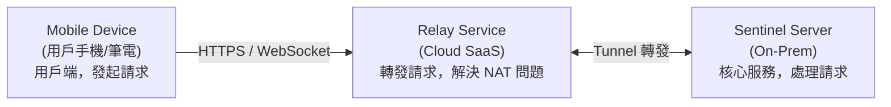
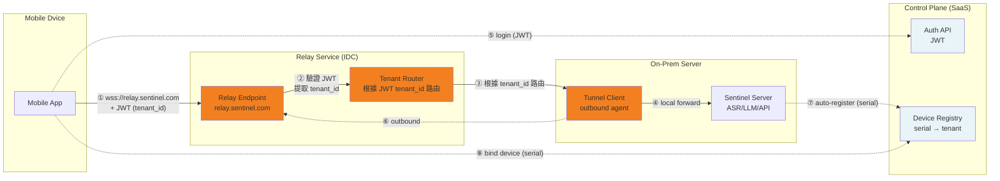
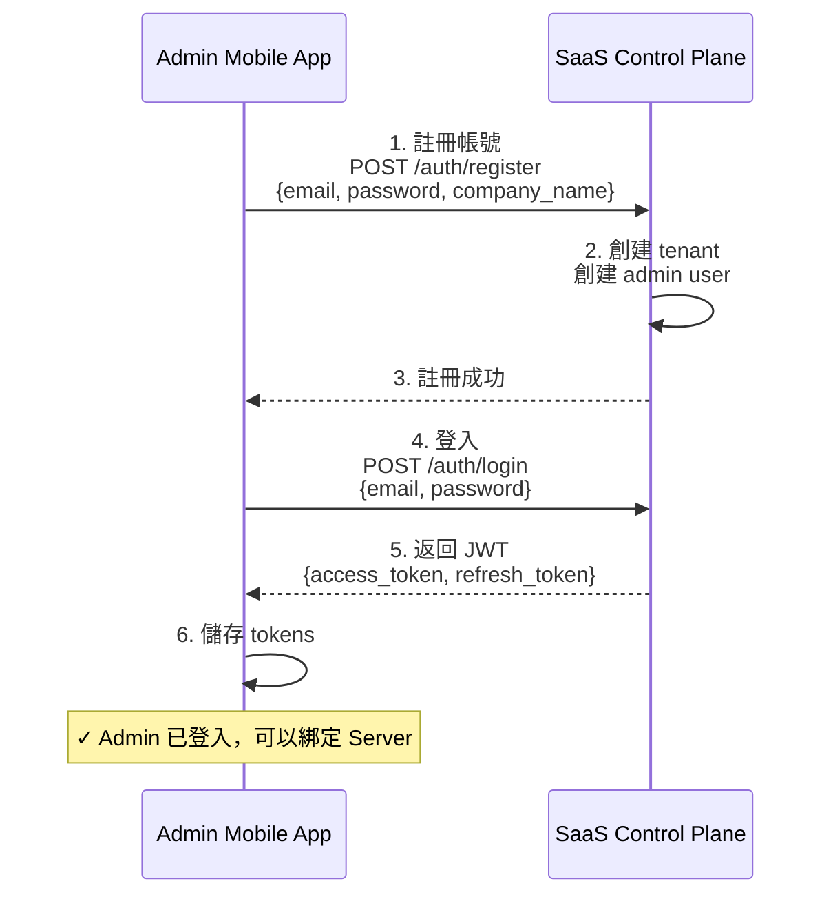
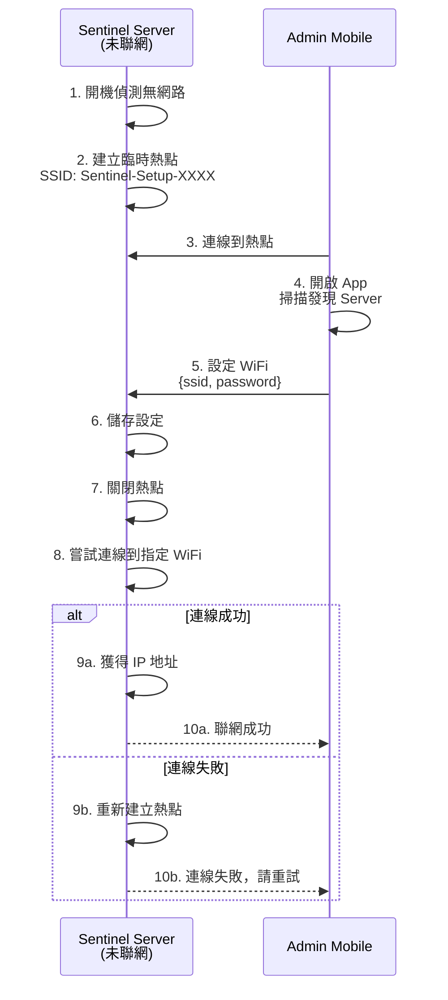
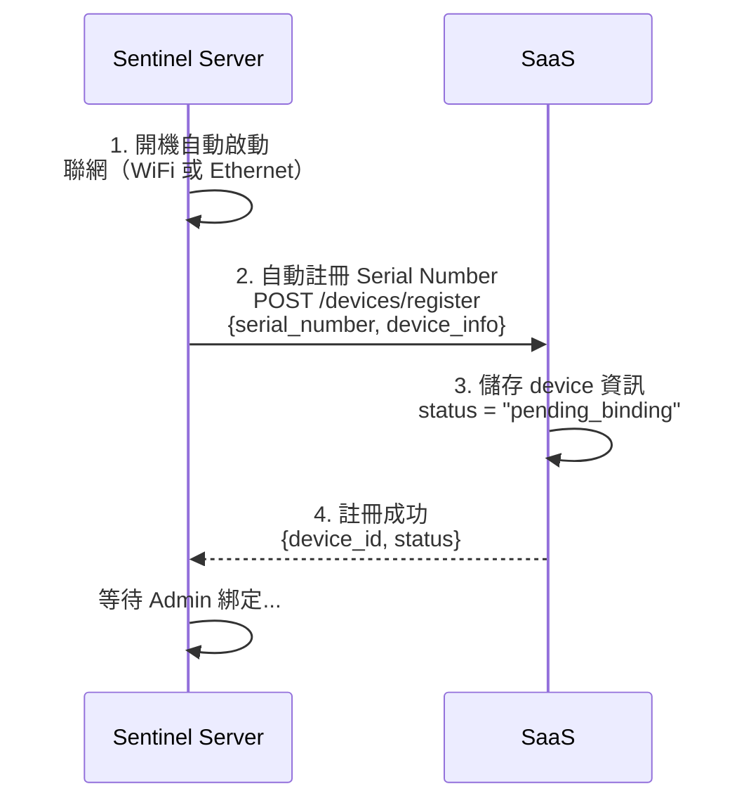
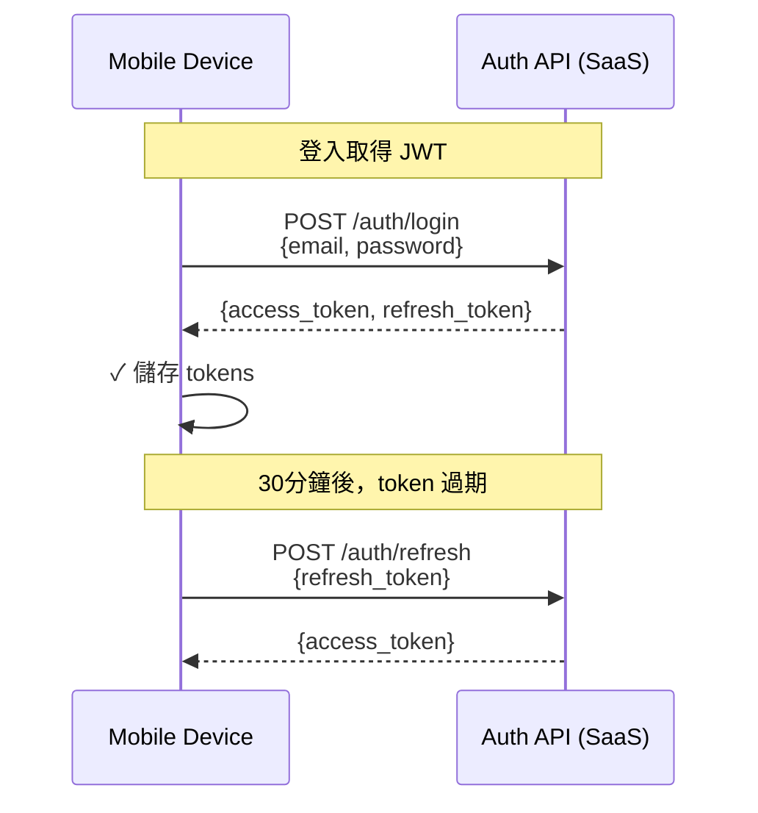
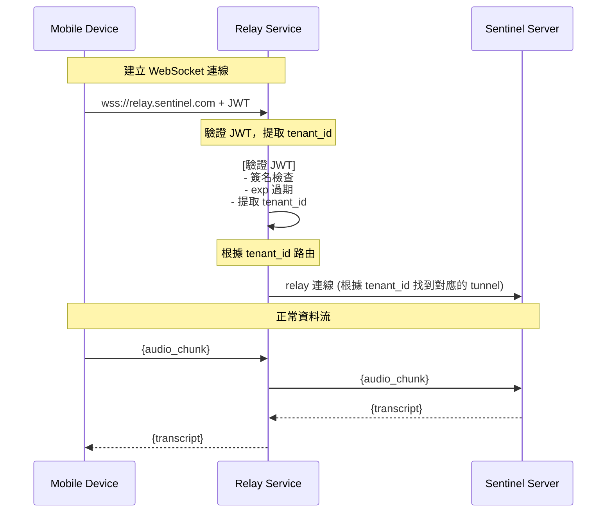

# Connectivity Architecture (連線架構)

## Overview

本文檔描述 Sentinel 系統的連線架構設計，解決 **On-Premise Server 位於 NAT 後方、無固定 IP** 的連線問題。

核心設計採用 **Relay Service 模式**：Mobile Device 透過 Cloud Relay 與 On-Prem Server 連線，同時配合 **JWT 本地驗證機制**，確保日常使用不依賴 SaaS，實現低延遲與離線運作能力。

**關鍵特性**：
- 🌐 **NAT 穿透**：Relay Service 解決無固定 IP 問題
- 🔐 **本地驗證**：Server 本地驗證 JWT，日常使用不經過 SaaS
- 🔌 **零接觸部署**：Server 開機自動註冊，支援 Ethernet/WiFi 連網
- 🏢 **Multi-Tenant**：統一 Relay + JWT tenant_id 路由，資料隔離

---

## 核心架構

**三個核心元件**：

| 元件 | 職責 | 部署位置 |
|------|------|----------|
| **Mobile Device** | 用戶端，發起請求 | 用戶手機/筆電 |
| **Relay Service** | 轉發請求，解決 NAT 問題 | Cloud (SaaS) |
| **Sentinel Server** | 核心服務，處理請求 | 客戶公司內 (On-Prem) |



> **Relay Service** 可實作為：Cloudflare Tunnel、ngrok、自建 relay 等

---

## 核心設計原則

| 階段 | 執行者 | 流程 | SaaS 參與？ |
|------|--------|------|------------|
| **0. Server 註冊** | Server（自動） | Server → SaaS → 註冊 serial | ✅ 是（自動註冊） |
| **0. Admin 綁定** | Admin | Mobile → SaaS → 綁定設備 | ✅ 是（綁定到租戶） |
| **1. 註冊/登入** | 使用者 | Mobile → SaaS → JWT | ✅ 是（取得 token） |
| **2. 日常使用** | 使用者 | Mobile → Relay → Server | ❌ **否**（本地驗證 JWT） |
| **3. JWT 過期** | 使用者 | Mobile → SaaS（refresh） | ✅ 是（更新 token） |

> **⚠️ 關鍵設計**：Server **本地驗證 JWT**（使用共享 secret 或公鑰），日常使用**不經過 SaaS**。

**好處**：
- ✅ 降低 latency（不需要每次都問 SaaS）
- ✅ 支援離線運作（SaaS 掛了仍可用）
- ✅ 資料不走 SaaS（隱私更好）

---

## 🏗️ 架構圖



### 架構說明

```
①②③④ 日常使用：Mobile → Relay (統一 domain) → 根據 JWT tenant_id 路由 → Server
⑤ 登入時：Mobile → Auth API → 取得 JWT (控制流)
⑥ 維持連線：Server → Relay → outbound tunnel
⑦ Server 註冊：Server → Device Registry (自動，用 serial number)
⑧ Admin 綁定：Mobile → Device Registry (綁定設備到租戶)
```

---

## 🧩 元件詳解

### 1. Mobile Device

**職責**：
- Setup Mode：連 hotspot、掃 QR、輸入 WiFi
- Normal Mode：連線、錄音、Chat

**需要的資訊**：
- Relay endpoint：`wss://relay.sentinel.com` (所有租戶統一)
- JWT token（從 Auth API 取得，包含 tenant_id）

---

### 2. Relay Service

**職責**：
- 提供統一的固定 domain：`relay.sentinel.com`
- 驗證 JWT，提取 tenant_id
- 根據 tenant_id 路由到對應的 on-prem server
- 解決 NAT / 無固定 IP 問題

**實作選項**：

| 實作 | 優點 | 缺點 |
|------|------|------|
| **Cloudflare Tunnel** | 免費、企業級、全球 CDN | 依賴第三方 |
| **自建 Relay** | 完全控制 | 需維護 infra |
| **ngrok** | 快速原型 | 非企業級 |
| **Tailscale** | 簡單、安全 | 需安裝 client |

**decision making**：
- 自建 Relay(可搭配linode螞蟻戰術)

---

### 3. Sentinel Server (On-Prem)

**啟動模式**：
- **開機自動啟動**：無需手動安裝或執行指令
- 支援 **Ethernet** 或 **WiFi** 聯網
- 聯網後自動註冊 Serial Number 到 SaaS

**職責**：
- 自動註冊到 SaaS（用 Serial Number）
- 維持 outbound tunnel（透過 Tunnel Client）
- 處理請求（ASR、LLM、Chat）
- **本地驗證 JWT**（用共享 secret 或公鑰，不查詢 SaaS）

> **關鍵能力**：Server 可完全離線運作，不需要 SaaS 支援。開機即用，無需維護。

---

### 4. Control Plane (SaaS)

**職責**：
- User 註冊/登入
- JWT 簽發
- Tenant 管理
- Device Registry（tenant ↔ relay 註冊）

**何時使用**：
- 登入時：取得 JWT
- Server 註冊：綁定到 relay

**何時不使用**：
- 日常 Audio/Chat：**不經過這裡**

---

## 🔄 Sentinel Server 註冊流程

> **前置條件**：User Admin 需先在 SaaS 上註冊帳號並登入

### 步驟 0：User Admin 註冊與登入（一次性）



### Server 聯網方式

在 Server 自動註冊之前，需要先讓 Server 聯網。Sentinel Server 支援兩種聯網方式：

| 方式 | 說明 | 操作方式 |
|------|------|----------|
| **Ethernet** | 有線網路，插上網線即可 | 將網線插入 Server，DHCP 自動取得 IP |
| **WiFi** | 無線網路，需要透過 Mobile App 設定 | **步驟**：<br/>1. Server 開機，偵測無網路連線<br/>2. Server 自動建立臨時熱點（SSID: Sentinel-Setup-XXXX）<br/>3. Mobile 連到此熱點<br/>4. 開啟 App，進入「設定 Server WiFi」頁面<br/>5. 選擇要連的 WiFi 並輸入密碼<br/>6. Server 儲存設定，關閉熱點，嘗試連線<br/>7a. **成功**：熱點保持關閉，聯網完成<br/>7b. **失敗**：Server 重新建立熱點，App 顯示錯誤並提示重試 |

> **熱點模式技術前提**：
> - WiFi 網卡支援 AP 模式
> - 系統預裝 hostapd（Linux）或相關軟體
> - 開機腳本自動偵測網路狀態並建立熱點

> **注意**：Server 開機後會自動偵測可用的網路連線並連線。聯網成功後會自動執行步驟 1 的註冊流程。

#### WiFi 設定流程



> **重要邏輯**：
> - WiFi 網卡不能同時作為 AP 和 Station，必須先關閉熱點
> - 如果連線失敗，Server 必須重新建立熱點，讓 Mobile 可以重試
> - Mobile 應該等待一段時間後掃描熱點，判斷是否連線成功

### 步驟 1：Server 聯網並自動註冊



#### 步驟 2：Admin Mobile 綁定機器

```mermaid
sequenceDiagram
    participant Admin as Admin Mobile<br/>(已登入, 有 JWT)
    participant SaaS as SaaS
    participant Relay as Relay Node
    participant Server as Sentinel Server

    rect rgb(86, 87, 89)
        Note over Server: Server 定期輪詢中...
        Server->>SaaS: 0a. 輪詢綁定狀態<br/>GET /devices/status
        SaaS-->>Server: 0b. status = pending_binding
    end

    Admin->>Admin: 1. 輸入/掃描 Serial Number
    Admin->>SaaS: 2. 綁定請求<br/>POST /devices/bind<br/>Authorization: Bearer JWT<br/>{serial_number}
    SaaS->>SaaS: 3. 從 JWT 取得 tenant_id<br/>驗證 Serial Number<br/>創建租戶關聯
    SaaS->>SaaS: 4. 儲存設定<br/>status = bound
    SaaS-->>Admin: 5. 綁定成功<br/>{relay_endpoint: "wss://relay.sentinel.com", status}

    rect rgb(86, 87, 89)
        Note over Admin: 等待 Server 連線...
        Admin->>Relay: 6a. 測試連線 Server (透過 Relay)
        Relay-->>Admin: 6b. 連線失敗（Server 尚未就緒）
        Admin->>Admin: 等待 5 秒...
    end

    rect rgb(69, 73, 64)
        Note over Server: Server 下次輪詢
        Server->>SaaS: 7. 輪詢綁定狀態<br/>GET /devices/status
        SaaS-->>Server: 8. status = bound<br/>{jwt_secret, relay_endpoint}
        Server->>Server: 9. 儲存設定<br/>啟動 Tunnel Client
        Server->>Relay: 10. 建立 Tunnel 連線到 wss://relay.sentinel.com
        Relay-->>Server: 11. 連線成功
        Note over Server,Relay: ✓ Server 就緒，可接受連線
    end

    rect rgb(69, 100, 69)
        Note over Admin: 重試連線
        Admin->>Relay: 12a. 測試連線 Server (透過 Relay)
        Relay->>Server: 12b. 轉發請求 (根據 tenant_id 路由)
        Server-->>Relay: 12c. Pong 回應
        Relay-->>Admin: 12d. ✓ 連線成功
        Admin->>Admin: 13. 顯示「✓ 綁定完成」
    end
```



**Server 配置檔案**（綁定後自動生成）：
```yaml
# /etc/sentinel/config.yaml
server:
  device_id: "device_xyz789"
  serial_number: "SN-2024-XXXX"
  tenant_id: "tenant_abc123"

jwt:
  secret_file: "/etc/sentinel/secrets/jwt_secret.key"  # 從 SaaS 取得

relay:
  type: "custom"
  endpoint: "wss://relay.sentinel.com"  # 所有租戶統一
```

**SaaS API**：
```bash
# 0. User Admin 註冊（User Admin → SaaS，一次性）
POST /api/v1/auth/register
{
  "email": "admin@acme.com",
  "password": "secure_password",
  "company_name": "Acme Corp"
}

# Response
{
  "user_id": "user_abc123",
  "tenant_id": "tenant_abc123",
  "message": "Registration successful"
}

# 1. User Admin 登入（Admin Mobile → SaaS）
POST /api/v1/auth/login
{
  "email": "admin@acme.com",
  "password": "secure_password"
}

# Response
{
  "access_token": "eyJ...",
  "refresh_token": "eyJ...",
  "tenant_id": "tenant_abc123",
  "user_id": "user_abc123"
}

# 1.1 Refresh Token（Mobile → SaaS，當 access_token 過期時）
POST /api/v1/auth/refresh
{
  "refresh_token": "eyJ..."
}

# Response (success)
{
  "access_token": "eyJ...",
  "expires_in": 900  # seconds (15 minutes)
}

# Response (error - refresh_token 無效或過期)
{
  "error": "invalid_refresh_token",
  "message": "Refresh token is invalid or expired. Please login again."
}

# 2. Server 自動註冊（Server → SaaS）
POST /api/v1/devices/register
{
  "serial_number": "SN-2024-XXXX",
  "device_info": {
    "model": "Sentinel-Server",
    "mac_address": "AA:BB:CC:DD:EE:FF",
    "ip_address": "192.168.1.100"
  }
}

# Response
{
  "device_id": "device_xyz789",
  "status": "pending_binding"
}

# 3. Server 輪詢狀態（Server → SaaS，定期）
GET /api/v1/devices/status?serial_number=SN-2024-XXXX

# Response (pending)
{
  "device_id": "device_xyz789",
  "status": "pending_binding"
}

# Response (bound - Admin 已綁定)
{
  "device_id": "device_xyz789",
  "status": "bound",
  "tenant_id": "tenant_abc123",
  "jwt_secret": "secret_xxx...",      # 用於本地驗證 JWT
  "relay_endpoint": "wss://relay.sentinel.com"  # 統一 Relay
}

# 4. Admin 綁定設備（Admin Mobile → SaaS，需 JWT）
POST /api/v1/devices/bind
Authorization: Bearer {access_token}
{
  "serial_number": "SN-2024-XXXX"
}

# Response
{
  "tenant_id": "tenant_abc123",
  "relay_endpoint": "wss://relay.sentinel.com",  # 統一 Relay
  "device_id": "device_xyz789",
  "status": "bound"
}
```

---

## 📱 日常使用流程

> **前提**：User Admin 已完成 Server 註冊流程（步驟 0-2）
> **重要**：此階段 **不經過 SaaS**。Server **本地驗證 JWT**（用共享 secret 或公鑰）。

### 使用者登入（取得 JWT）

一般使用者透過 Mobile App 登入取得 JWT：



**JWT 時效性**：

| Token | 有效期 | 用途 |
|-------|--------|------|
| **access_token** | 15-30 分鐘 | 連線 Server、API 請求 |
| **refresh_token** | 7-30 天 | 換新的 access_token |

### 正常使用（資料流）

> **⚠️ 重要**：此階段 **不經過 SaaS**。Relay **驗證 JWT**，根據 tenant_id 路由到對應 Server。



---

## 🌐 連線模式

### 模式 1：Relay（主要）

```
Mobile → Relay Endpoint → Server

Latency: ~50-150ms (取決於 relay 實作)
場景: 外網連線
```

### 模式 2：LAN Direct（可選）

```
Mobile → Server (直接連線)

Latency: ~5-10ms
場景: 同一 WiFi
```

---

## 📝 訊息協定

### Auth API

```bash
# Request
POST /auth/login
{"email": "user@company.com", "password": "..."}

# Response
{
  "jwt": "eyJ...",
  "tenant_id": "tenant_a",
  "relay_endpoint": "wss://relay.sentinel.com"  # 統一 Relay
}
```

### WebSocket 訊息

```json
// Auth
{"type": "auth", "token": "jwt..."}

// Audio
{"type": "audio_chunk", "session_id": "...", "data": "base64..."}

// Transcript
{"type": "transcript", "text": "...", "is_final": false}

// Chat
{"type": "chat_query", "query": "..."}
{"type": "chat_chunk", "text": "...", "is_final": false}
```

---

## 🔐 安全性

### JWT Token 結構

```json
{
  "iss": "sentinel.com",           // 簽發者
  "sub": "user_12345",              // 用戶 ID
  "aud": "tenant_a",                // 租戶 ID
  "exp": 1735689600,                // 過期時間 (15-30分鐘)
  "iat": 1735686000,                // 簽發時間

  "user_id": "user_12345",
  "email": "user@company.com",
  "tenant_id": "tenant_a",
  "role": "user",                   // user | admin | root

  "capabilities": [                 // 能力列表
    "audio:record",
    "audio:upload",
    "chat:rag",
    "session:view"
  ]
}
```

### JWT 用途

| 時機 | 用途 | 說明 |
|------|------|------|
| **連線 Server** | 認證 | 證明「我是谁」（Server **本地驗證**） |
| **每個請求** | 授權 | 檢查「我能做什麼」 |
| **資料隔離** | Tenant routing | 根據 tenant_id 隔離資料 |

**使用場景**：
```
1. Mobile 連 Server 時：
   → 送出 JWT
   → Server 本地驗證簽名 + exp（用共享 secret 或公鑰）
   → 確認 tenant_id
   → 允許連線

2. 每個請求（Audio/Chat）：
   → 附上 JWT
   → Server 檢查 capabilities
   → 執行或拒絕
```

> **注意**：Server 驗證 JWT 時**不查詢 SaaS**，完全本地驗證。

### JWT 認證流程

```
1. User 登入 Auth API → 取得 access_token + refresh_token
2. Mobile 儲存 tokens
3. 連線 Server 時送出 access_token
4. Server 驗證（本地驗證，不問 SaaS）：
   - 簽名是否有效（用共享 secret 或公鑰）
   - 是否過期 (exp)
   - tenant_id 是否匹配
5. access_token 過期 → 用 refresh_token 換新的
```

> **⚠️ 關鍵設計**：Server **本地驗證 JWT**，無需查詢 SaaS。這意味著：
> - 日常使用完全**不經過 SaaS**（降低 latency）
> - 支援**離線運作**（SaaS 掛了仍可用）
> - SaaS 只負責**登入和 token 管理**

### Tenant Isolation

```
- 所有 tenant = 統一連接 relay.sentinel.com
- JWT 包含 tenant_id
- Relay 根據 tenant_id 路由到對應的 Server
- Server 根據 tenant_id 隔離資料
```

---

## 📊 Multi-Tenant

```
所有 Tenant: relay.sentinel.com (統一 Relay)
               ↓
         根據 JWT tenant_id 路由
               ↓
    ┌──────────┼──────────┐
    ↓          ↓          ↓
Server A    Server B    Server C
(tenant_a) (tenant_b) (tenant_c)
```

---

## 💡 實作建議

### Phase 1: MVP

```
使用 Cloudflare Tunnel（免費、快速）

優點：
- 不需要建 relay infra
- 快速驗證產品
- 企業級可靠度
```

### Phase 2: 優化（可選）

```
考慮自建 relay 或 P2P

場景：
- 需要更低 latency
- 想要完全控制
- 成本考量
```

---

## 📚 相關文檔

- [System Overview](./systemOverview.md)
- [System Architecture](./systemArch.md)
- [Container Diagram](./containerDiagram.md)

---

## 🔄 版本歷史

| Version | Date | Changes |
|---------|------|---------|
| 16.5 | 2025-03-27 | **修正 WiFi 設定流程圖**：移除 WiFi AP participant（Server 建立熱點時自己就是 AP） |
| 16.4 | 2025-03-27 | **修正 WiFi 設定流程邏輯**：加入連線失敗後重新建立熱點的機制，確保 Mobile 可以重試 |
| 16.3 | 2025-03-27 | **補充熱點模式技術前提**：WiFi 網卡需支援 AP 模式，系統需預裝 hostapd 等軟體 |
| 16.2 | 2025-03-27 | **更新 WiFi 設定方式**：移除 WPS（PC 小主機無按鈕），只保留 Mobile App 設定方式並新增流程圖 |
| 16.1 | 2025-03-27 | **補充 WiFi 聯網具體操作方式**：WPS 按鈕、Mobile App 設定（臨時熱點） |
| 16.0 | 2025-03-27 | **整理文件結構**：移除重複的「階段 1：登入」，新增「日常使用流程」章節 |
| 15.2 | 2025-03-27 | **步驟 0 與步驟 1 之間加入 Server 聯網方式說明** |
| 15.1 | 2025-03-27 | **修正步驟 0**：User Admin 直接透過 Mobile App 註冊（非先網頁後下載 App） |
| 15.0 | 2025-03-27 | **章節改名並加入步驟 0**：「連線流程」→「Server 註冊流程」，加入 User Admin 註冊與登入步驟 |
| 14.0 | 2025-03-27 | **步驟 2 加入連線測試**：Admin 需透過 Relay 測試連線 Server 成功後才顯示綁定完成 |
| 13.0 | 2025-03-27 | **調整步驟 2 流程**：Server 定期輪詢 SaaS 獲取設定（而非 Mobile 通知） |
| 12.0 | 2025-03-27 | **階段 0 改用 mermaid diagram**，統一圖表格式 |
| 11.0 | 2025-03-27 | **重新設計階段 0**：Server 自動註冊 + Admin 綁定流程（移除 Setup UI） |

