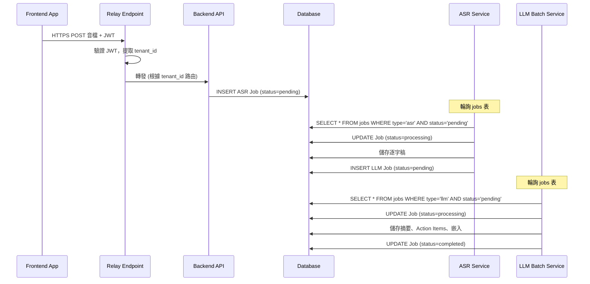
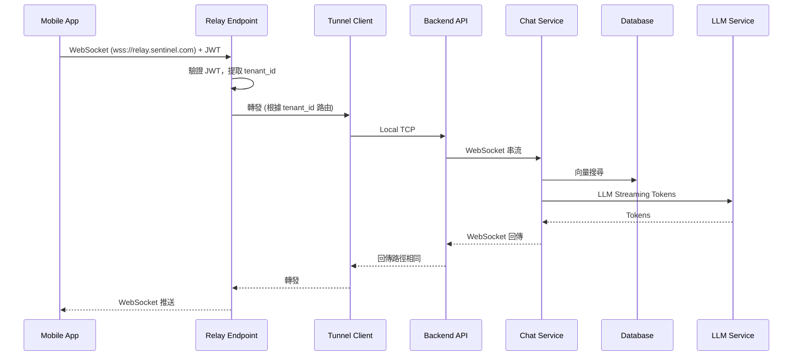
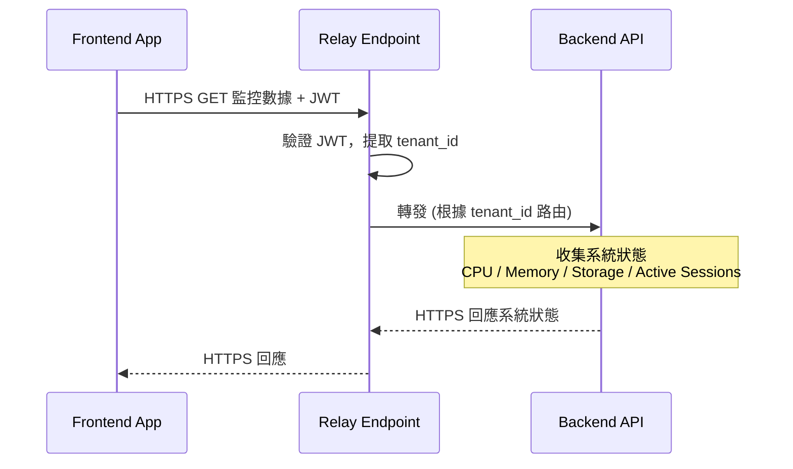
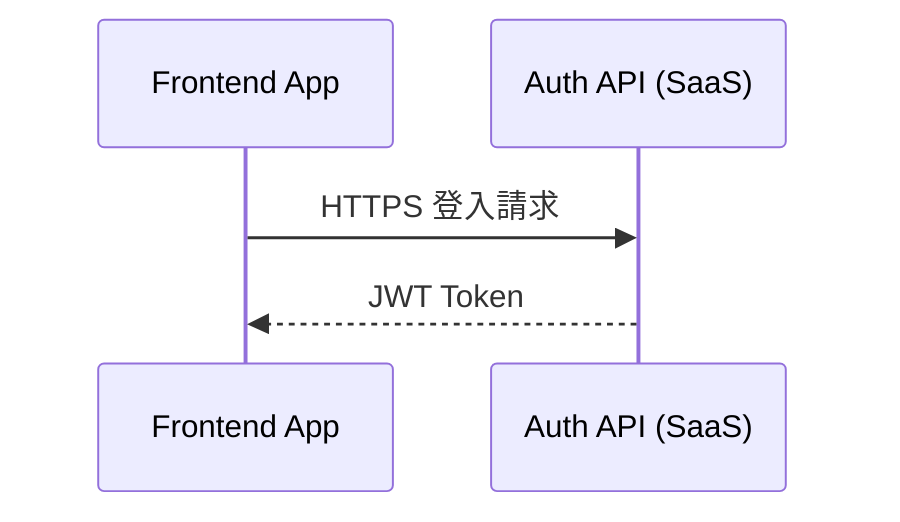

# Container Diagram (容器圖)

## 圖表位置
`/Users/mary/code/sentinel/containerDiagram.mmd`

## 什麼是 Container Diagram？

**Container Diagram** 是 C4 模型的第二層，展示系統內部的「容器」及其互動關係。

> ⚠️ **注意**: 這裡的「Container」指的是 **邏輯容器**（應用程式、資料庫、訊息佇列等），不是 Docker 容器！


---


## 容器說明

### 前端容器 (Client Applications)

| 容器 | 技術 | 職責 |
|------|------|------|
| **Frontend App** | Desktop / iOS / Android | 錄音、上傳、Chat 查詢 |

### 雲端基礎設施 (Cloud Infrastructure - SaaS)

| 容器 | 技術 | 職責 |
|------|------|------|
| **Relay Endpoint** | 自建 Relay Server (Rust) | NAT 穿透、流量轉發、根據 JWT tenant_id 路由 |
| **Auth API** | REST API | JWT 簽發、用戶認證、Token 刷新 |
| **Device Registry** | Database + API | 設備註冊、Serial Number → Tenant 映射 |

### 後端容器 (Sentinel Server - On-Premise)

| 容器 | 技術 | 職責 |
|------|------|------|
| **Tunnel Client** | 自建 agent | 維持 outbound tunnel 連線 |
| **Backend API** | NestJS + Local JWT Validation | REST API、WebSocket（僅 Chat）、音檔儲存、系統監控 |
| **ASR Service** | HTTP API | 語音轉文字（批次處理） |
| **LLM Batch Service** | - | 批次處理：摘要、Action Items、嵌入 |
| **Chat Service** | WebSocket Streaming | Chat 查詢處理 (RAG / Agent)，串流回應 |

### 資料儲存 (Data Stores)

| 容器 | 技術 | 職責 |
|------|------|------|
| **Database** | PostgreSQL + pgvector | 儲存會議資料、逐字稿、向量、jobs 表 |

> **Jobs 表輪詢機制**：ASR Service 和 LLM Batch Service 分別輪詢自己的 jobs，無需額外 Worker |

---

## 容器間通訊

### 通訊協定

| 連結 | 協定 | 用途 |
|------|------|------|
| Frontend → Auth API | **HTTPS** | 登入、取得 JWT、刷新 Token |
| Frontend → Device Registry | **HTTPS** | 綁定設備到租戶 |
| Frontend → Relay Endpoint | **HTTPS / WebSocket** | 上傳音檔（HTTPS） / Chat 串流（WebSocket） |
| | | **統一連接**: `wss://relay.sentinel.com` |
| | | **路由依據**: JWT 中的 tenant_id |
| Relay Endpoint ↔ Tunnel Client | **TCP** | 流量轉發 |
| Tunnel Client → Backend API | **Local TCP** | 本地轉發請求 |
| Backend API → Device Registry | **HTTPS** | 設備註冊、輪詢綁定狀態 |
| Backend API → Chat Service | **WebSocket** | Chat 查詢串流回應 |
| Backend API → Database | SQL | 讀寫資料、新增 Job |
| ASR Service → Database | SQL (Poll + Write) | 輪詢 ASR Jobs、寫入逐字稿 |
| LLM Batch Service → Database | SQL (Poll + Write) | 輪詢 LLM Jobs、寫入處理結果 |
| Chat Service → Database | SQL | 查詢/寫入 |

---

## 主要資料流

### 1. 音訊處理流程（經過 Relay）

#### 錄音完成 → 批次處理



### 2. Chat 查詢流程 (WebSocket Streaming，經過 Relay)



### 3. 監控流程（HTTPS 輪詢，經過 Relay）



### 4. 認證流程（直連 SaaS）



---

## C4 層級對應

```
Level 1: System Context Diagram
    │
    │ 展開系統內部結構
    ▼
Level 2: Container Diagram (本圖)
    │
    │ 展開 Chat Module 內部組件
    ▼
Level 3: Component Diagram
    │
    │ 展開部署結構
    ▼
Level 4: Deployment Diagram
```

---

## 關鍵設計決策

| 決策 | 原因 |
|------|------|
| **Backend API 作為中央閘道** | 統一請求入口、易於管理認證授權 |
| **監控功能集成於 Backend API** | 功能簡單、數據源在內部、降低部署複雜度 |
| **ASR Service 採用 HTTP** | 簡化通訊，批次處理即可，無需 gRPC 複雜度 |
| **WebSocket 僅用於 Chat** | Chat 需要串流 LLM 回應，其他功能用 HTTP 即可 |
| **資料庫即 Job Queue** | 用 jobs 表存任務，各 Service 自己輪詢處理，無需額外依賴 |
| **PostgreSQL + pgvector** | 支援關聯式資料與語意搜尋 |
| **自建 Relay vs ngrok** | 詳見 [Relay Server 設計](./relayServerDesign.md#0-技術選型-ngrok-vs-自建) |

---

## 相關文檔
- [Sytem overview](./systemOverview.md) - 系統要求
- [Context Diagram](./contextDiagram.md) - 上一層：系統脈絡
- [Container Diagram](./containerDiagram.md) - 下一層：系統內部容器架構
- [System Architecture](./systemArch.md) - 完整系統架構說明
- [Data Flow](./dataflow.md) - 詳細資料流程
