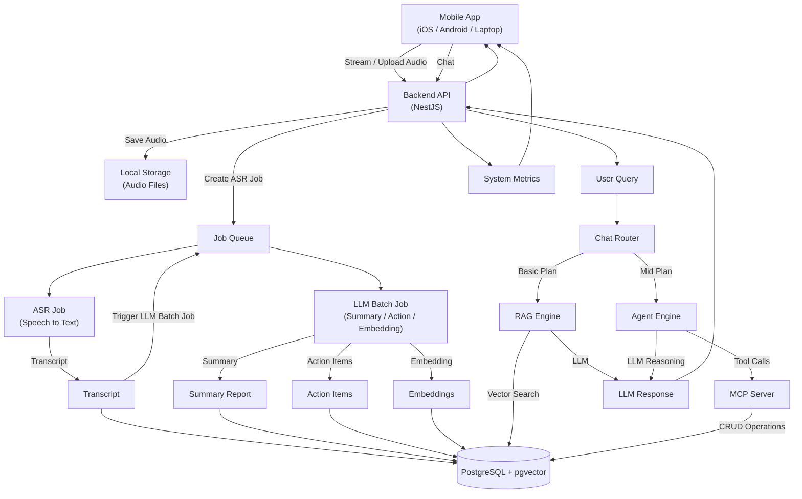

```mermaid
flowchart TD
%% Client
A["Mobile App<br>(iOS / Android / Laptop)"]

%% Backend
B["Backend API<br>(NestJS)"]

%% Storage
C["Local Storage<br>(Audio Files)"]
D[(PostgreSQL + pgvector)]

%% Queue
E[Job Queue]

%% Jobs
F["ASR Job<br>(Speech to Text)"]
G["LLM Batch Job<br>(Summary / Action / Embedding)"]

%% Outputs
H[Transcript]
I[Summary Report]
J[Action Items]
K[Embeddings]

%% Chat Module
L[User Query]
M[Chat Router]
N[RAG Engine]
O[Agent Engine]
P[MCP Server]
Q[LLM Response]

%% Monitoring
R[System Metrics]

%% ===== Ingestion Flow =====
A -->|Stream / Upload Audio| B
B -->|Save Audio| C
B -->|Create ASR Job| E

E --> F
F -->|Transcript| H
H --> D

H -->|Trigger LLM Batch Job| E
E --> G

G -->|Summary| I
G -->|Action Items| J
G -->|Embedding| K

I --> D
J --> D
K --> D

%% ===== Chat Flow =====
A -->|Chat| B
B --> L
L --> M

M -->|Basic Plan| N
M -->|Mid Plan| O

N -->|Vector Search| D
N -->|LLM| Q

O -->|Tool Calls| P
P -->|CRUD Operations| D
O -->|LLM Reasoning| Q

Q --> B
B --> A

%% ===== Monitoring =====
B --> R
R --> A

```
