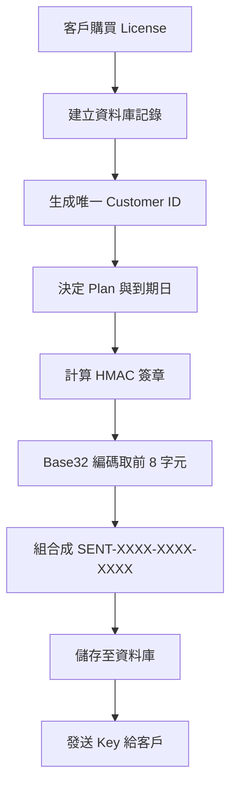
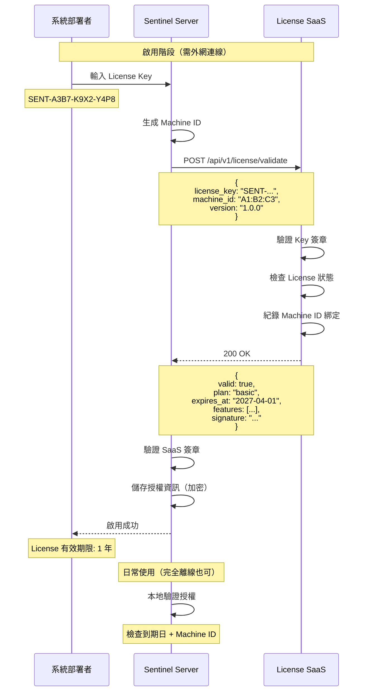
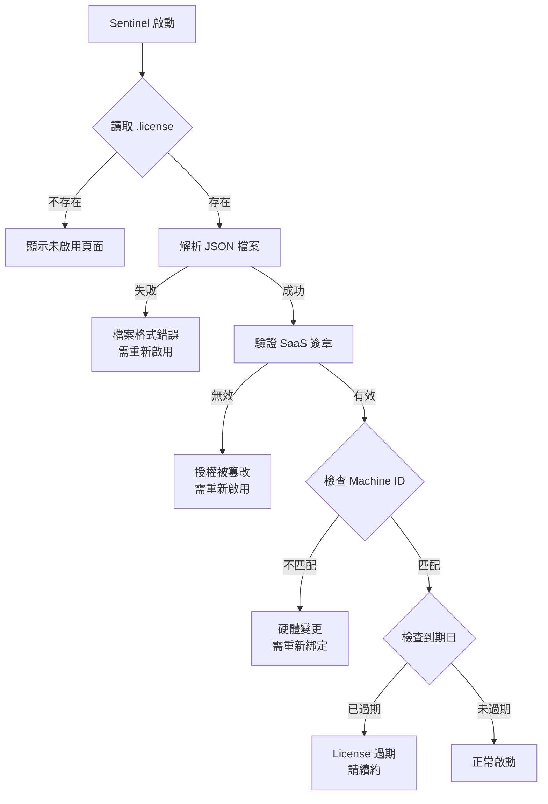
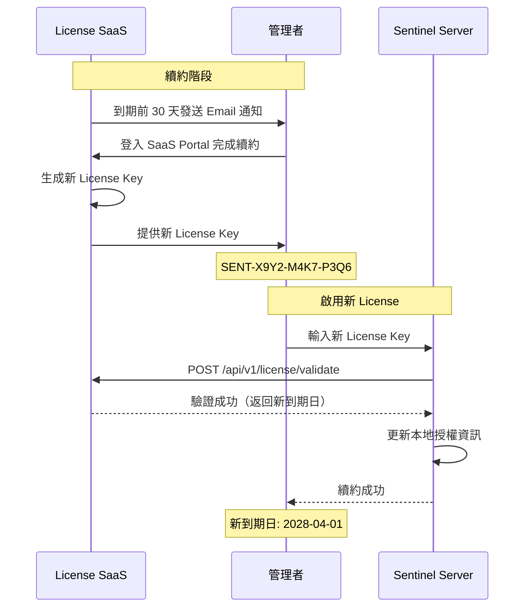
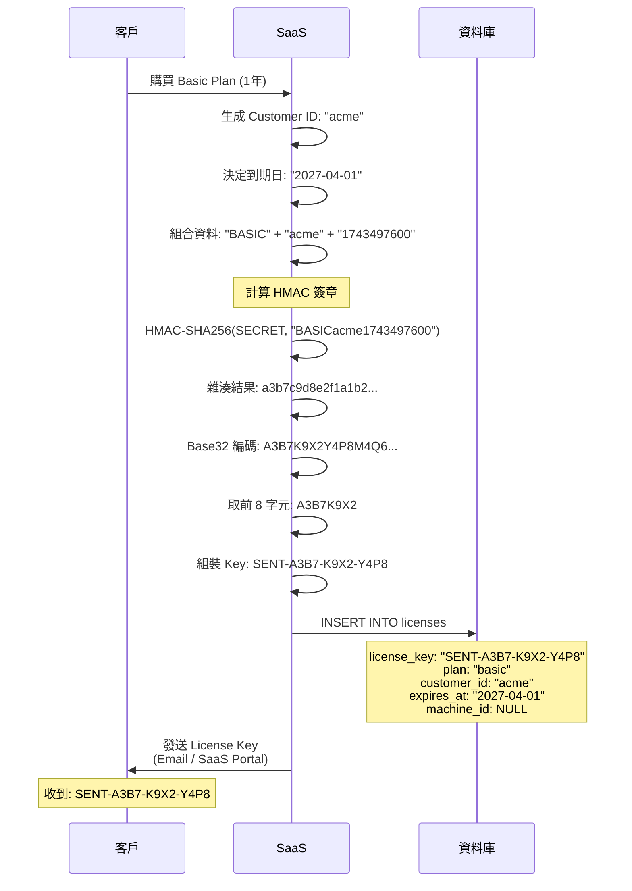
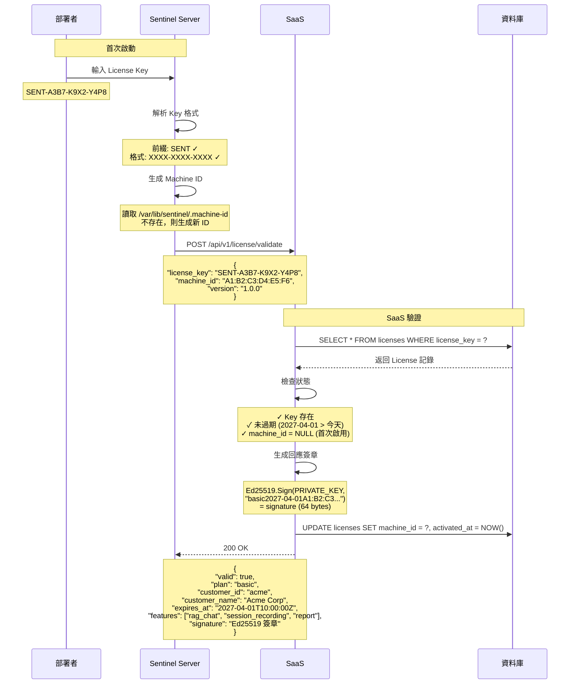
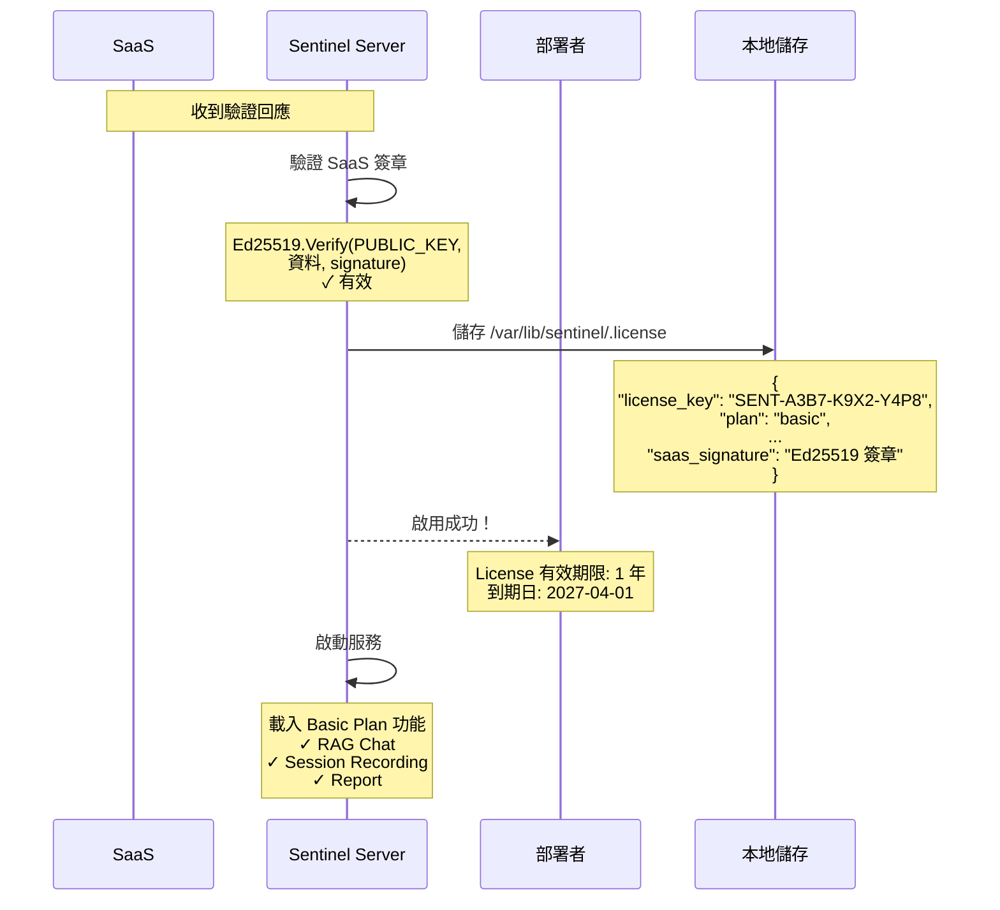
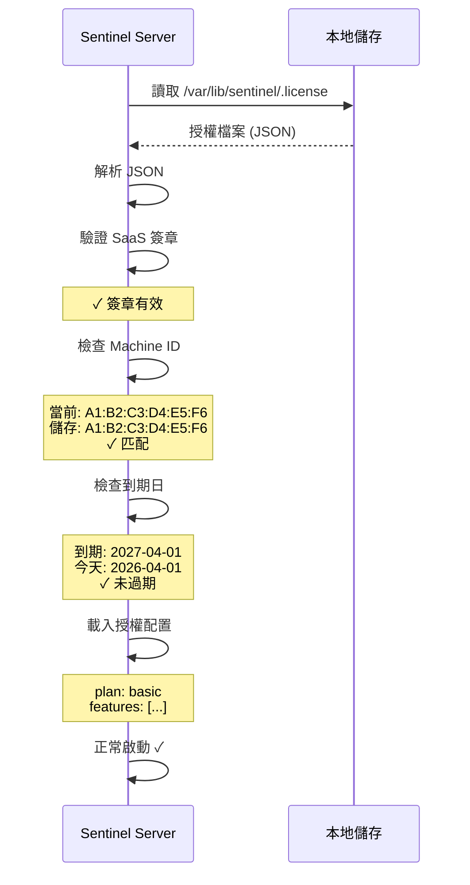
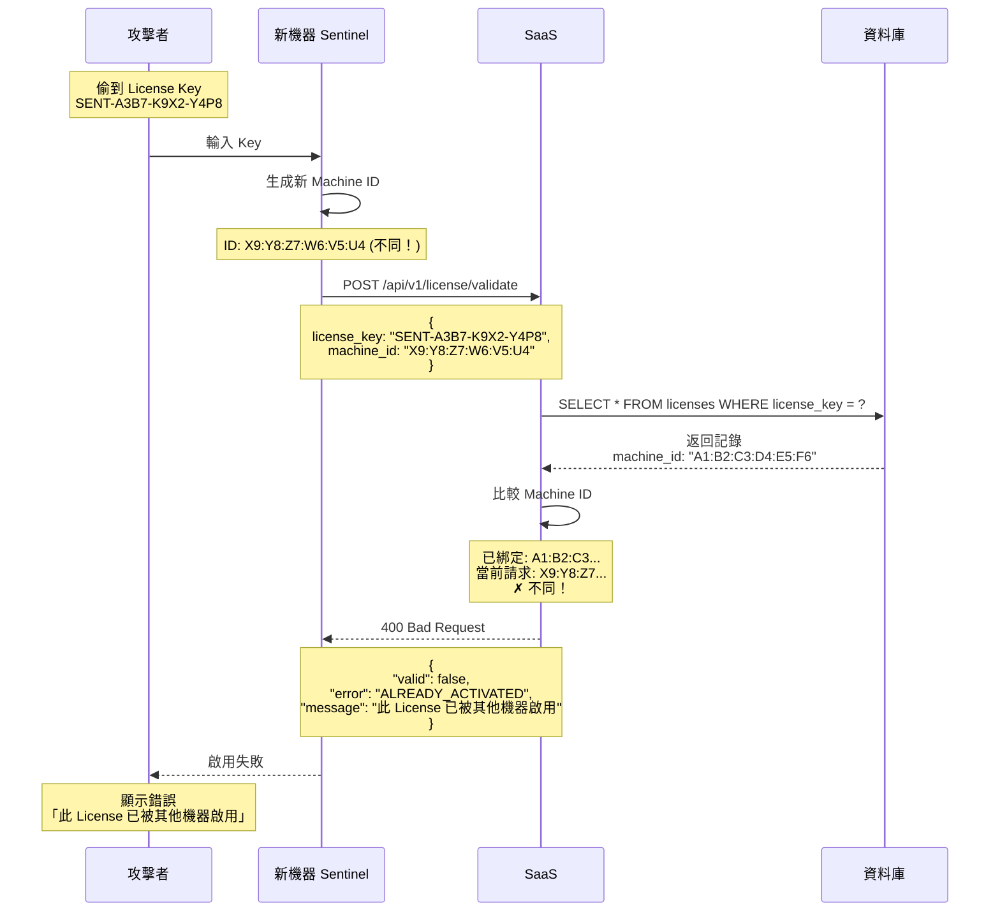

# License Activation Design

## Overview

Sentinel 採用 License-based 授權機制，客戶需在首次啟動時輸入 License Key 並通過 SaaS 驗證以啟用服務。

**設計假設**：目標客戶為一般企業環境，啟用時具備外網連線。


---

## License Key Format

### 短碼格式（19 字元）
```
SENT-XXXX-XXXX-XXXX
```

**範例**: `SENT-A3B7-K9X2-Y4P8`

**欄位說明**:
- `SENT`: 固定前綴
- `XXXX-XXXX-XXXX`: 8 字元簽章碼（Base32 編碼，移除易混淆字元 0/O, 1/I/l）

### 簽章生成
```
SIGNATURE = BASE32(HMAC-SHA256(SECRET_KEY, PLAN + CUSTOMER_ID + TIMESTAMP))[0:8]
```

**安全性**:
- 8 字元 = 16^8 ≈ 43 億組合
- 配合 API Rate Limiting（5 次/分鐘）防止暴力破解

---

## Machine ID 生成

為防止同一 License 被多台機器使用，需綁定 Machine ID。

### 採用持久化 + Fallback 方案

傳統硬體特徵（CPU ID、MAC、Disk Serial）在 VM/雲端環境不穩定。

**改進方案**：首次啟動時生成並持久化

```
優先順序：
1. 讀取 /var/lib/sentinel/.machine-id（已存在則使用）
2. dmidecode system-uuid（實體機）
3. /etc/machine-id（systemd 系統）
4. 生成隨機 UUID 並儲存
```

**儲存位置**：`/var/lib/sentinel/.machine-id`

**特性**：
- 生成後永久不變（除非刪除檔案）
- 實體機用硬體 UUID，VM/雲端用持久化 ID
- VM 克隆會有相同 ID，SaaS 可偵測並拒絕

---

## SaaS 端：Key 生成與驗證

### Key 生成流程



### 資料庫 Schema

```sql
CREATE TABLE licenses (
    id UUID PRIMARY KEY,
    license_key VARCHAR(19) UNIQUE NOT NULL,
    customer_id VARCHAR(50) NOT NULL,
    plan VARCHAR(20) NOT NULL,
    expires_at TIMESTAMP NOT NULL,
    machine_id VARCHAR(50),
    activated_at TIMESTAMP,
    created_at TIMESTAMP DEFAULT NOW()
);
```

### 驗證邏輯

```
1. 解析 License Key 格式
   └─ 檢查前綴 "SENT" 與格式

2. 從資料庫查詢 License
   └─ SELECT * FROM licenses WHERE license_key = ?

3. 驗證 License 狀態
   ├─ License 不存在 → LICENSE_NOT_FOUND
   ├─ 已過期 → LICENSE_EXPIRED
   └─ 已被啟用且 machine_id 不同 → ALREADY_ACTIVATED

4. 綁定 Machine ID
   └─ UPDATE licenses SET machine_id = ?, activated_at = NOW()

5. 生成回應簽章
   └─ Ed25519.Sign(PRIVATE_KEY, plan + expires_at + machine_id)

6. 返回授權資訊
```

---

## Activation Flow

### 線上啟用 (Online Activation)



---

## Local Storage

### 授權資訊儲存

```json
{
  "license_key": "SENT-A3B7-K9X2-Y4P8",
  "plan": "basic",
  "customer_id": "acme",
  "customer_name": "Acme Corp",
  "machine_id": "A1:B2:C3:D4:E5:F6",
  "activated_at": "2026-04-01T10:00:00Z",
  "expires_at": "2027-04-01T10:00:00Z",
  "features": ["rag_chat", "session_recording", "report"],
  "saas_signature": "Ed25519 簽章 (64 bytes base64)"
}
```

**儲存位置**: `/var/lib/sentinel/.license`

**儲存格式**: 明文 JSON + 簽章驗證

---

## 為什麼簽章驗證就夠了？

### 安全需求分析

| 威脅 | 簽章驗證是否防護 | 加密是否額外幫助 |
|------|------------------|------------------|
| 篡改授權資訊 | ✅ 簽章驗證失敗 | ❌ 不需要 |
| 複製檔案到另一台機器 | ✅ Machine ID 不匹配 | ❌ 不需要 |
| 偽造授權檔案 | ✅ 無法偽造簽章 | ❌ 不需要 |
| 讀取授權資訊 | ❌ 明文可讀 | ⚠️ 可隱藏 |

### 簽章如何防護篡改

```
SaaS 生成回應時（私鑰簽章）：
  回應資料 + PRIVATE_KEY → Ed25519 簽章 → signature

Sentinel 驗證時（公鑰驗證）：
  儲存的資料 + signature + PUBLIC_KEY → Ed25519 驗證
  結果：有效 / 無效
    ✅ 有效 → 資料未被篡改
    ❌ 無效 → 資料被修改，拒絕啟動
```

**關鍵**：私鑰只有 SaaS 知道，公鑰內嵌在 Sentinel
- Sentinel 能驗證簽章，但無法偽造（沒有私鑰）
- 攻擊者修改任何欄位 → 簽章驗證失敗

### 簽章如何防護檔案複製

```
攻擊者複製 /var/lib/sentinel/.license 到新機器：

1. 檔案中的 machine_id: "A1:B2:C3:D4:E5:F6"
2. 新機器的 machine_id: "X9:Y8:Z7:W6:V5:U4"
3. Sentinel 比較：A1:B2:C3... != X9:Y8:Z7...
4. 結果：機器 ID 不匹配，啟動失敗
```

### 為什麼不需要加密

1. **簽章已保護完整性**：任何修改都會被偵測
2. **Machine ID 已綁定機器**：複製檔案無效
3. **授權資訊非敏感**：plan、到期日不是機密
4. **簡化實作**：不需要管理加密金鑰、salt 等
5. **降低複雜度**：減少潛在的加密相關 bug

### Ed25519 公私鑰簽章

```
SaaS 端（私鑰）：
  PRIVATE_KEY → Ed25519.Sign(資料) → signature

Sentinel 端（公鑰）：
  PUBLIC_KEY + signature → Ed25519.Verify(資料) → 有效/無效
```

**特性**：
- 私鑰簽章，公鑰驗證
- 私鑰外洩 = 系統被攻破
- 公鑰公開 = 無風險（只能驗證，不能偽造）

---

## License Validation

### Sentinel 端：啟動時驗證邏輯



### 驗證步驟詳解

```
1. 讀取授權檔案
   └─ /var/lib/sentinel/.license

2. 解析 JSON 檔案
   └─ 解析失敗 → 檔案格式錯誤

3. 驗證 SaaS 簽章
   └─ Ed25519.Verify(PUBLIC_KEY, 資料, signature)
   └─ 確保授權資訊未被篡改
   └─ 簽章無效 → 授權被篡改

4. 檢查 Machine ID
   └─ 比較儲存的 machine_id 與當前機器
   └─ 不匹配 → 硬體變更或克隆

5. 檢查到期日
   └─ expires_at > NOW()
   └─ 已過期 → 需續約

6. 載入授權配置
   └─ plan, features
   └─ 啟動服務
```

### 錯誤處理

| 錯誤 | 處理方式 | 使用者體驗 |
|------|----------|------------|
| 未啟用 | 顯示啟用頁面 | 輸入 License Key |
| 檔案格式錯誤 | 刪除錯誤檔案 | 重新輸入 License Key |
| 簽章無效 | 刪除檔案 | 授權被篡改，重新啟用 |
| Machine ID 不匹配 | 提示重新綁定 | 聯絡 SaaS 支援 |
| License 過期 | 顯示續約提示 | 輸入新 License Key |

**無需聯網**：所有驗證在本地完成

---

## API Definition

### SaaS License Validation API

**Endpoint**:
```http
POST /api/v1/license/validate
```

**Request**:
```http
Content-Type: application/json

{
  "license_key": "SENT-A3B7-K9X2-Y4P8",
  "machine_id": "A1:B2:C3:D4:E5:F6",
  "version": "1.0.0"
}
```

**Response (Success)**:
```http
200 OK

{
  "valid": true,
  "plan": "basic",
  "customer_id": "acme",
  "customer_name": "Acme Corp",
  "expires_at": "2027-04-01T10:00:00Z",
  "features": ["rag_chat", "session_recording", "report"],
  "signature": "Ed25519 簽章 (base64, 64 bytes)"
}
```

**Response (Error)**:
```http
400 Bad Request

{
  "valid": false,
  "error": "LICENSE_EXPIRED",
  "message": "License expired on 2026-03-01"
}
```

**錯誤代碼**:
| Code | 說明 |
|------|------|
| `INVALID_KEY` | Key 格式錯誤 |
| `INVALID_SIGNATURE` | Key 簽章無效（偽造） |
| `LICENSE_EXPIRED` | License 已過期 |
| `ALREADY_ACTIVATED` | License 已被其他機器啟用 |
| `LICENSE_NOT_FOUND` | License 不存在 |
| `RATE_LIMITED` | 請求過於頻繁 |

**Rate Limiting**:
- 限制：每 IP 每 5 次請求
- 視窗：60 秒
- 超限回傳 429 Too Many Requests

---

## Renewal Flow

### License 續約



---

## Security Considerations

1. **傳輸加密**: 所有 API 通信必須使用 HTTPS (TLS 1.3+)
2. **Key 保護**: License Key 不以明文顯示於日誌或錯誤訊息
3. **Rate Limiting**: 驗證 API 實作 IP-based throttling
4. **Audit Log**: SaaS 端記錄所有啟用/驗證請求
5. **簽章驗證**: Ed25519 公私鑰機制
   - SaaS 用私鑰簽章（絕不外洩）
   - Sentinel 用公鑰驗證（內嵌於程式）
6. **Machine ID 綁定**: 防止同一 License 被多台機器使用

---

## Error Handling

### 常見錯誤場景

| 錯誤 | 顯示訊息 | 解決方式 |
|------|----------|----------|
| Key 格式錯誤 | 「License Key 格式不正確，應為 SENT-XXXX-XXXX-XXXX」 | 檢查輸入 |
| License 過期 | 「License 已於 2026-03-01 過期，請聯絡 SaaS 續約」 | 聯絡 SaaS |
| 已被啟用 | 「此 License 已被其他機器啟用」 | 聯絡 SaaS 重新綁定 |
| Machine ID 變更 | 「硬體識別碼變更，需重新綁定」 | 聯絡 SaaS 重新綁定 |
| 網路錯誤 | 「無法連線至 SaaS，請檢查網路連線」 | 檢查網路 |

---

## Apeendix: 完整 Activation 流程演示

### 概念說明：License vs License Key

| License (授權) | License Key (金鑰) |
|----------------|-------------------|
| 完整的授權記錄 | 短字串標識符 |
| 存在 SaaS 資料庫 | 給客戶的「票據」 |
| 包含所有資訊 | 用來查找 License |

```
License Key (SENT-XXXX-XXXX-XXXX) → 查找資料庫 → License (完整記錄)
```

### 階段 1：客戶購買，SaaS 生成 License Key



### 階段 2：部署者輸入 Key，Sentinel 驗證



### 階段 3：Sentinel 儲存並啟用



### 階段 4：日常開機驗證（完全離線）



### 階段 5：有人嘗試複製 Key 到另一台機器



### 流程總結

| 階段 | 需要聯網 | 說明 |
|------|----------|------|
| 1. 生成 Key | - | SaaS 端完成 |
| 2. 驗證 Key | ✅ 需要 | Sentinel 連線 SaaS |
| 3. 儲存啟用 | ✅ 需要 | 儲存授權資訊 |
| 4. 日常驗證 | ❌ 不需要 | 完全本地驗證 |
| 5. 防複製 | ✅ 需要 | SaaS 綁定 Machine ID |
