# OTA (Over-The-Air) Update Design

## Overview

Sentinel 採用 **分層 OTA 更新機制**，支援兩層更新：
1. **OS 層** (Linux): 系統核心更新，使用 A/B 分區避免設備磚化
2. **容器層** (Docker): 應用程式更新，包含 Backend API、ASR、LLM、Chat 服務及模型

系統支援三種更新模式：
- **自動更新**: 設備定期檢查並下載更新
- **手動更新**: 管理員主動觸發更新
- **離線更新**: 透過 USB 傳輸更新套件（氣隔環境）

---

## Update Scope

| 層級 | 更新內容 | 更新頻率 | 風險等級 |
|------|----------|----------|----------|
| **OS 層** | Linux kernel、系統套件、安全修補 | 低頻 (季度/年度) | 高 - 失敗可能導致無法開機 |
| **容器層** | Backend API、ASR、LLM、Chat 服務、模型映像 | 高頻 (週/月) | 中 - 服務可回滾 |


---

## Architecture Components

### System Architecture

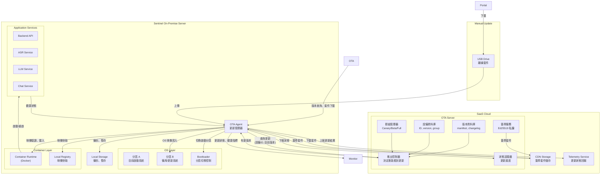

### Component Responsibilities

#### SaaS Cloud Components

| Component | Responsibility |
|-----------|----------------|
| **OTA Server** | 版本管理、設備群組管理、簽章套件生成、推出控制 |
| **CDN Storage** | 儲存簽章後的更新套件 |
| **Telemetry Service** | 接收設備更新狀態回報、記錄成功/失敗 |

### OTA Server 具體職責

| 功能 | 說明 |
|------|------|
| **版本管理** | 儲存每個版本的 manifest、changelog、套件位置 |
| **設備註冊** | 維護設備清單（設備 ID、目前版本、硬體型號、群組） |
| **群組管理** | 將設備分群（Canary 5%、Beta 25%、Full 100%） |
| **簽章** | 將套件 manifest 用私鑰簽章，產生 signature.sig |
| **推出控制** | 根據群組、版本兼容性決定哪些設備能看到更新 |
| **狀態追蹤** | 記錄每台設備的更新狀態（idle/downloading/installing/success/failed） |
| **推出暫停** | 當 Canary 失敗率超過閾值，停止推送到後續群組 |

#### On-Premise Components

| Component | Responsibility |
|-----------|----------------|
| **OTA Agent** | 檢查更新、下載套件、驗證簽章、執行更新、健康檢查、回滾決策 |
| **Bootloader** | A/B 分區切換控制 |
| **Container Runtime** | 映像載入、容器生命週期管理 |
| **Local Registry** | 映像快取、版本管理 |
| **Local Storage** | 備份映像、資料庫快照、暫存檔案 |

---

## Update Package Design

### Package Types

| 類型 | 格式 | 內容 | 大小 |
|------|------|------|------|
| **OS Update Package** | `.img.tar.gz` | 完整 OS 映像、kernel、bootloader | 1-2 GB |
| **Container Update Package** | `.tar.gz` | Docker images (含 ASR/LLM 模型)、migrations、config | 2-15GB |
| **Offline Package** | `.tar.gz` | 包含 OS + Container 套件 | 3-20GB |

### Package Manifest

每個更新套件包含以下資訊：

| 欄位 | 用途 |
|------|------|
| **version** | 目標版本號 (遵循 Semantic Versioning) |
| **package_type** | OS / Container |
| **previous_version** | 上一版本號 (用於驗證升級路徑) |
| **release_date** | 發布日期 |
| **build_number** | 建置編號 |
| **changelog** | 更新內容說明 |
| **total_size** | 套件總大小 |
| **requires_migration** | 是否需要資料庫遷移 |
| **estimated_downtime** | 預估停機時間 |
| **min_compatible_version** | 最低相容版本 |
| **signature_algorithm** | 簽章演算法 |
| **checksums** | 各檔案的雜湊值 |

### Package Components

```
sentinel-release-v{VERSION}.tar.gz
├── manifest.json              # 套件資訊
├── signature.sig              # 數位簽章
├── checksums.sha256           # 檔案完整性驗證
│
├── [OS Layer - 僅 OS 套件]
│   └── os-image.img           # OS 映像
│
├── [Container Layer]
│   ├── images/                # Docker images (含模型)
│   │   ├── sentinel-backend.tar
│   │   ├── sentinel-asr.tar      # 含 ASR 模型
│   │   ├── sentinel-llm.tar      # 含 LLM 模型
│   │   └── sentinel-chat.tar
│   └── migrations/            # Database migrations
│       └── *.sql
```

---

## Security Design

### Security Layers

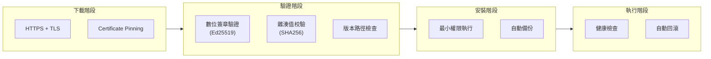

### Security Mechanisms

| 威脅 | 防護措施 |
|------|----------|
| **惡意套件** | Ed25519 數位簽章驗證 |
| **傳輸竄改** | HTTPS + Certificate Pinning |
| **重放攻擊** | 版本檢查 + monotonic 版本號 |
| **權限提升** | OTA Agent 以最小權限執行 |
| **資料遺失** | 更新前自動備份 (映像 + 資料庫) |
| **回滾失敗** | 保留多版本備份 |

### Signature Verification Flow

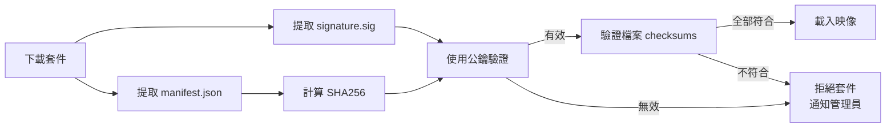

### Key Management

| 金鑰類型 | 位置 | 用途 |
|----------|------|------|
| **私鑰** | SaaS (HSM/加密儲存) | 簽署更新套件 |
| **公鑰** | OTA Agent (建置時內建) | 驗證套件簽章 |
| **金鑰版本** | SaaS + Agent | 支援金鑰輪換 |

---

## Update Flow Design

### Update Modes

| 模式 | 觸發方式 | 網路需求 | 適用場景 |
|------|----------|----------|----------|
| **自動更新** | 定期檢查 | 需外網 | 一般設備，維持最新版本 |
| **手動更新** | 管理員觸發 | 需外網 | 控制更新時機 |
| **離線更新** | USB 上傳 | 無需外網 | 氣隔環境 |

### Generic Update Flow

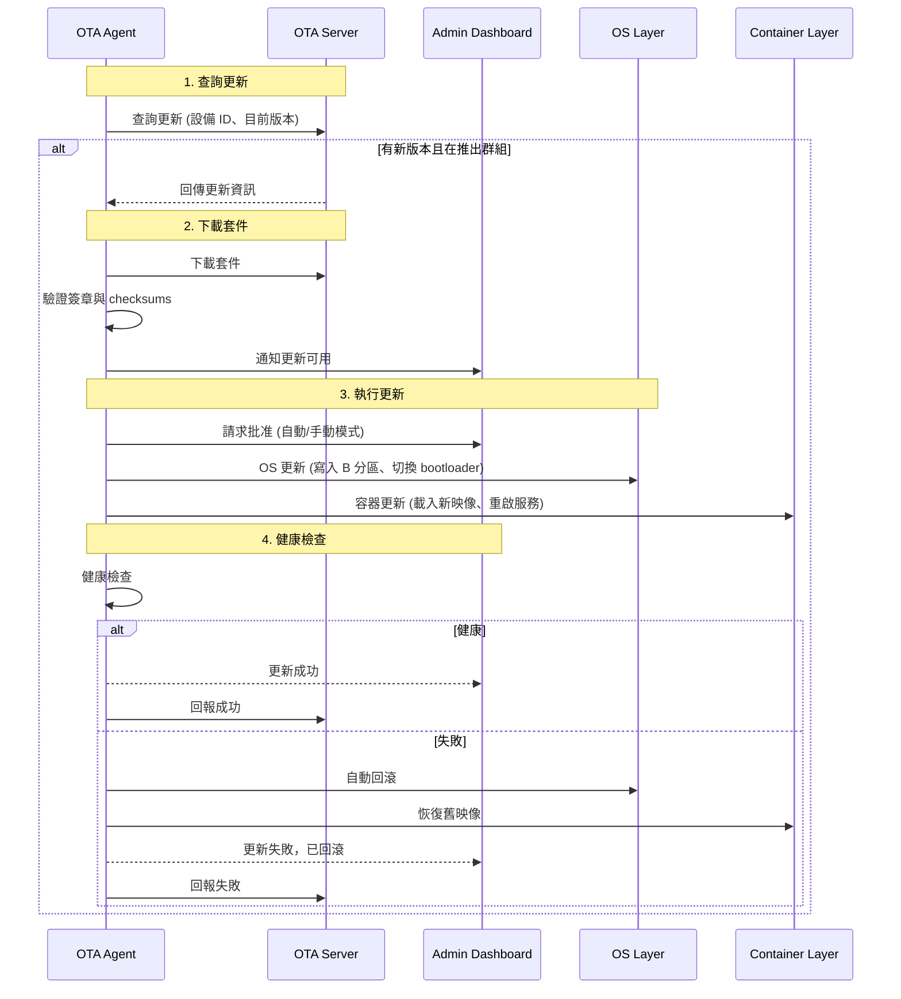

### Mode-Specific Differences

| 步驟 | 自動更新 | 手動更新 | 離線更新 |
|------|----------|----------|----------|
| **觸發** | 定期檢查 | 管理員點擊 | USB 上傳 |
| **套件來源** | SaaS CDN | SaaS CDN | 本地上傳 |
| **批准方式** | 維護時段內自動/需批准 | 每次需批准 | 上傳即執行 |
| **通訊** | 與 SaaS 雙向 | 與 SaaS 雙向 | 本地驗證，僅回報結果 |

### Canary Rollout Strategy

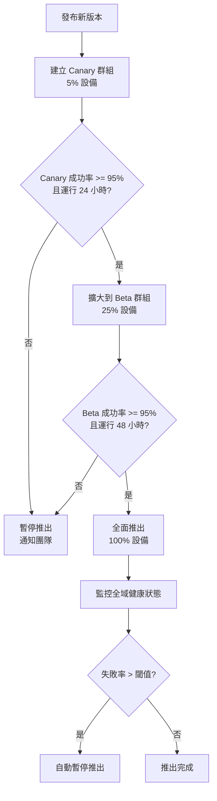

**分群條件**：硬體版本、地理區域、客戶類型、網路環境

---

## Data Persistence in A/B Partition

### Disk Layout

```
┌─────────────────────────────────────────────────────────────┐
│ Boot Partition (共享)                                       │
│ - bootloader configuration                                 │
│ - kernel (A/B)                                             │
├─────────────────────────────────────────────────────────────┤
│ Partition A (/) ← OS 系統檔 (rootfs)                       │
│ - /bin, /lib, /usr...                                      │
├─────────────────────────────────────────────────────────────┤
│ Partition B (/) ← OS 系統檔 (rootfs, 備用)                 │
│ - /bin, /lib, /usr...                                      │
├─────────────────────────────────────────────────────────────┤
│ Data Partition (/var) ← 共享資料，不會被 OS 更新覆蓋        │
│ ├─ /var/lib/docker/     ← Docker 映像、容器               │
│ ├─ /var/lib/postgresql/ ← 資料庫檔案                      │
│ └─ /var/lib/sentinel/   ← 應用程式資料、音訊檔           │
├─────────────────────────────────────────────────────────────┤
│ Config Partition (/etc) ← 共享設定，不會被 OS 更新覆蓋      │
│ - docker-compose.yml                                       │
│ - application configs                                      │
└─────────────────────────────────────────────────────────────┘
```

### Data Safety During OS Update

| 資料類型 | 位置 | OS 更新時 |
|----------|------|-----------|
| Docker 映像 | `/var/lib/docker` | ✅ 保留 (在 Data 分區) |
| 資料庫 | `/var/lib/postgresql` | ✅ 保留 (在 Data 分區) |
| 音訊檔 | `/var/lib/sentinel` | ✅ 保留 (在 Data 分區) |
| 應用設定 | `/etc` | ✅ 保留 (在 Config 分區) |
| OS 系統檔 | `/` (分區 A/B) | ❌ 被覆蓋 (這是預期) |

### OS Update Flow with Data Preservation

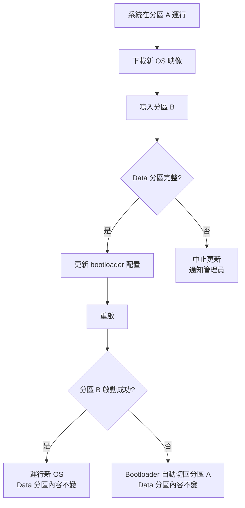

---

## Rollback Design

### Rollback Trigger Conditions

| 條件 | 觸發動作 |
|------|----------|
| **健康檢查失敗** | 連續 N 次失敗 |
| **服務無法啟動** | 重啟 M 次後仍失敗 |
| **資料庫遷移失敗** | 遷移腳本回傳錯誤 |
| **手動觸發** | 管理員主動回滾 |

### Rollback Decision Flow

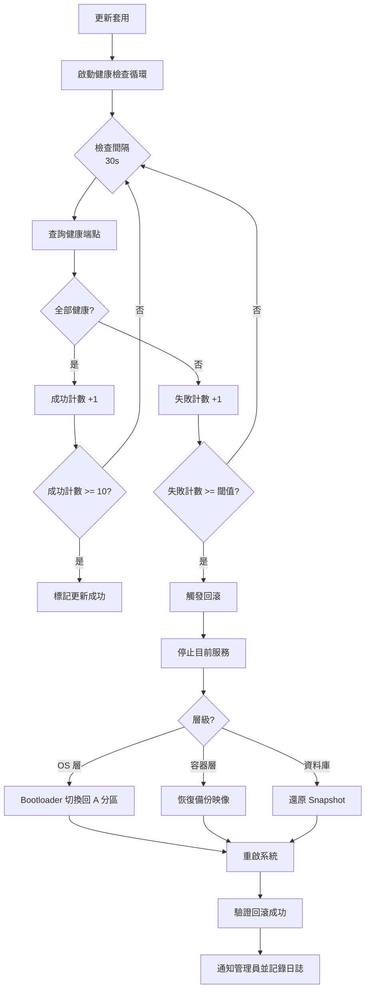

### Rollback Strategies by Layer

| 層級 | 回滾機制 | 恢復時間 |
|------|----------|----------|
| **OS 層** | Bootloader 切換至 A 分區 | 系統重啟時間 |
| **容器層** | 恢復備份映像標籤 | 30-60 秒 |
| **資料庫** | 從 snapshot 還原 | 視資料量 |
| **設定檔** | 恢復備份設定 | 即時 |

### Rollback Fallback

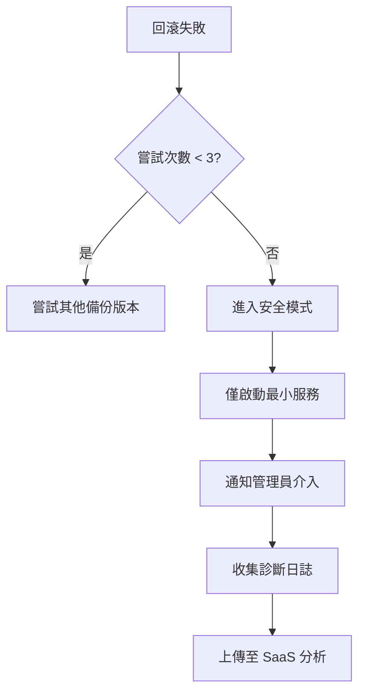

---

## Versioning & Compatibility

### Semantic Versioning

```
MAJOR.MINOR.PATCH
  │     │     └─ Bug fixes, hotfixes
  │     └────── New features, config changes
  └──────────── Breaking changes, migration required
```

### Update Impact Matrix

| 版本變更 | 自動安裝 | 停機時間 | 需要遷移 | 回滾複雜度 |
|----------|----------|----------|----------|------------|
| PATCH (1.0.x → 1.0.y) | ✅ 是 | ~0s | 否 | 低 |
| MINOR (1.0.x → 1.1.z) | ⚠️ 需批准 | ~30s | 可能 | 中 |
| MAJOR (1.x → 2.0) | ❌ 手動 | 計劃停機 | 是 | 高 |

### Compatibility & Migration

| 檢查項目 | 說明 |
|----------|------|
| **min_compatible_version** | 目前版本必須 >= 最低相容版本 |
| **previous_version** | 跳過版本升級時發出警告 |
| **requires_migration** | 需要遷移時：備份 → 停止服務 → 執行遷移 → 驗證 |

---

---

## Health Check Design

### Health Check Architecture

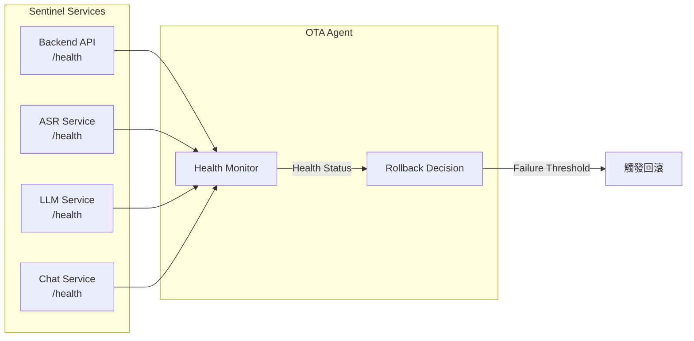

**健康檢查回應**：status (healthy/unhealthy/degraded)、version、timestamp、各組件狀態

---

## Monitoring & Telemetry

### Telemetry Data Flow

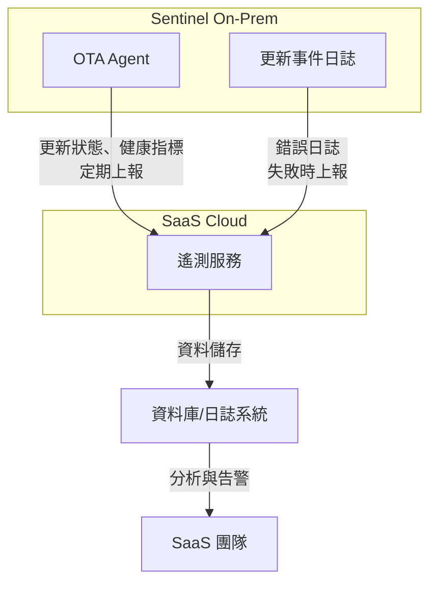

### Telemetry Data Points

| 類別 | 資料點 | 用途 |
|------|--------|------|
| **更新狀態** | 設備 ID、版本、更新狀態、時間戳 | 追蹤更新進度 |
| **健康指標** | CPU、記憶體、磁碟、服務狀態 | 判斷是否回滾 |
| **錯誤日誌** | 錯誤類型、堆疊、相關日誌 | 失敗分析 |
| **更新統計** | 成功率、失敗率、平均時間 | 漸進式推出決策 |

### Alert Conditions

| 條件 | 嚴等級 | 動作 |
|------|--------|------|
| Canary 群組失敗率 > 5% | 高 | 暫停推出 |
| 單一設備更新失敗 | 中 | 記錄、可選通知 |
| 健康檢查連續失敗 | 高 | 自動回滾 |
| 更新時間超過預期 | 中 | 記錄 |

> 通知機制不在本設計範圍，可由客戶自行決定是否啟用

---

## Error Handling

### Error Categories

| 類別 | 範例 | 恢復策略 |
|------|------|----------|
| **下載錯誤** | 網路逾時、空間不足 | 重試 (3x)、建議離線更新 |
| **驗證錯誤** | 簽章無效、checksum 不符 | 拒絕套件、通知管理員 |
| **安裝錯誤** | 映像載入失敗、遷移錯誤 | 自動回滾 |
| **執行時錯誤** | 服務崩潰、健康檢查失敗 | 自動回滾 |

### Error Recovery Flow

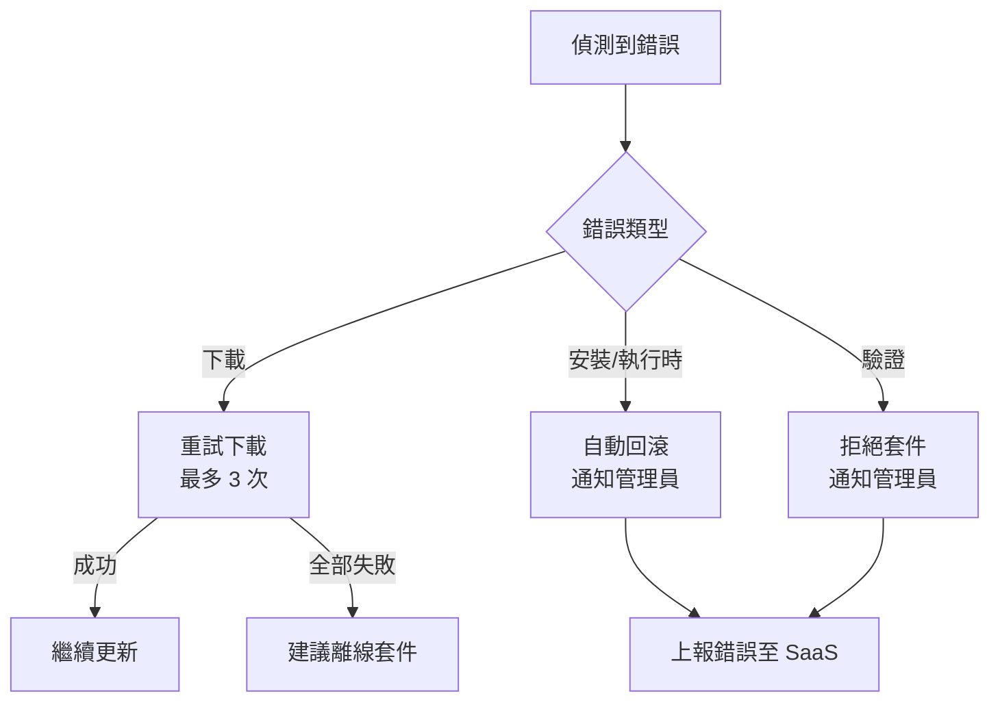

---

## Special Considerations

### Large Container Images

ASR/LLM 容器包含模型檔案，映像大小可達 10GB+，需考量：

| 考量 | 說明 |
|------|------|
| **傳輸時間** | 支援斷點續傳 |
| **儲存空間** | 更新前檢查可用空間 |
| **暫存策略** | 下載後驗證，再載入映像 |
| **回滾** | 保留舊映像版本 |

### Configuration Drift

| 情境 | 處理方式 |
|------|----------|
| 新增欄位 | 使用預設值，提示管理員檢查 |
| 移除欄位 | 忽略舊欄位 |
| 欄位改名 | 自動轉換 |
| 結構變更 | 執行 migration script |

### Multi-Instance Coordination

| 情境 | 處理方式 |
|------|----------|
| 單一設備 | 獨立更新 |
| 多設備 (同客戶) | 交錯更新，避免全體離線 |
| 全域推出 | Canary → Beta → 全面 |

---

## Related Diagrams

- [Container Diagram](./containerDiagram.md) - OTA Agent 在容器架構中的位置
- [System Architecture](./systemArch.md) - 完整系統架構
