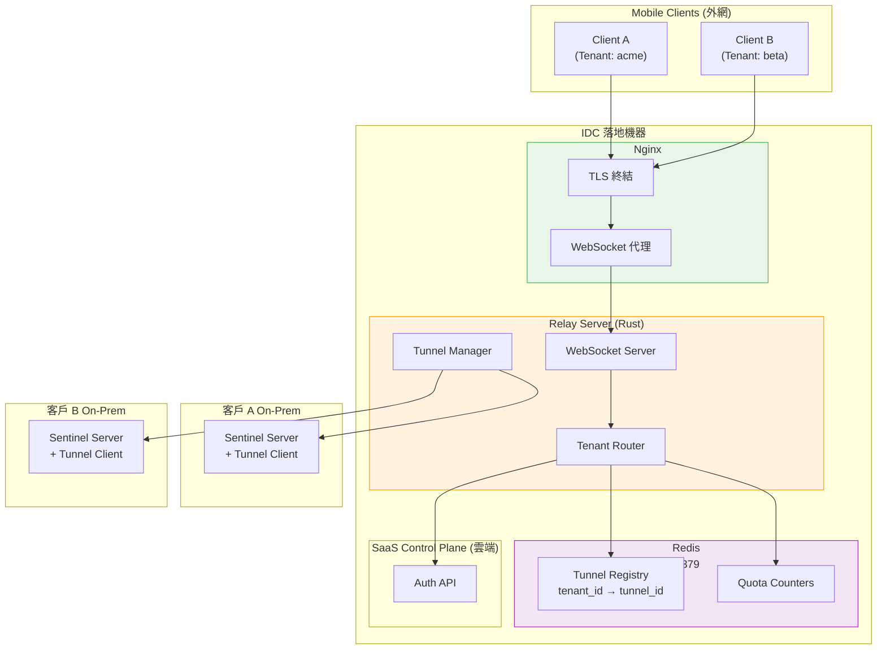
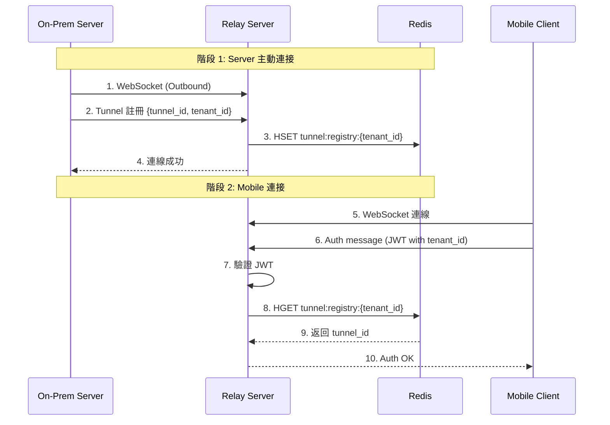

# Relay Server 設計文檔

設計自建 Relay Server，實現 NAT 穿透，讓 Mobile Client 能連接到客戶 On-Premise 的 Sentinel Server。

**架構**：Nginx + Rust + Redis
**目標讀者**：後端工程師、系統架構師
**最後更新**：2026-03-30

---

## 0. 技術選型：ngrok vs 自建

| 比較項目 | ngrok (SaaS) | 自建 Relay Server |
|---------|--------------|-------------------|
| **部署複雜度** | ⭐ 極簡 | ⭐⭐⭐ 需自行開發 |
| **成本** | 💰 ~$216/月/連線 | 💰 ~$50/月（統一） |
| **多租戶隔離** | ❌ 需用 subdomain 區分 | ✅ 原生支援 |
| **與 Auth API 整合** | ❌ 需額外整合 | ✅ 深度整合 |
| **資料隱私** | ⚠️ 流量經 ngrok | ✅ 流量經我們自己的 IDC |

**結論**：選擇自建，成本在規模化後更低、可與現有服務深度整合。

---

## 1. 核心架構

### 1.1 系統架構圖



### 1.2 連線流向

```
Mobile (外網) → Nginx (TLS) → Relay (Rust) → On-Prem Sentinel Server (NAT 後方)
```

**核心設計**：
1. 所有 Client 連到 `wss://relay.sentinel.com`
2. JWT 中帶有 `tenant_id`
3. Relay 根據 `tenant_id` 查 Redis，路由到對應的 Tunnel
4. 客戶 Server 主動建立 outbound 連線到 Relay

### 1.3 核心元件

| 元件 | 職責 |
|------|------|
| **Nginx** | TLS 終結、限流、WebSocket 轉發 |
| **WebSocket Server** | 接受 Client 和 Tunnel 連線 |
| **Tenant Router** | 根據 JWT tenant_id 路由 |
| **Tunnel Manager** | 管理 Tunnel 連線、心跳 |
| **Redis** | Tunnel 註冊、連線狀態、配額 |

---

## 2. 資料流設計

### 2.1 Tunnel 註冊與連接流程



### 2.2 訊息轉發

```
Client → Relay → Server (On-Prem)
       ←        ←
```

---

## 3. 多租戶隔離

### 3.1 路由機制

**所有 Client 連到同一個 domain**：
```
wss://relay.sentinel.com
```

**Relay 根據 JWT 中的 tenant_id 路由**：
```rust
let tenant_id = verify_jwt(jwt)?.tenant_id;  // "acme"
let tunnel = redis.get(format!("tunnel:registry:{}", tenant_id))?;
forward(websocket, tunnel);
```

### 3.2 隔離保證

- ✅ Tenant A 的流量無法訪問 Tenant B 的 Tunnel
- ✅ 每個 Tenant 獨立的配額限制
- ✅ 租戶間的連線計數隔離

---

## 4. 通訊協議

### 4.1 連接方式

| 來源 | URL | 認證 |
|------|-----|------|
| **Mobile Client** | `wss://relay.sentinel.com` | JWT (第一條訊息) |
| **On-Prem Server** | `wss://relay.sentinel.com/tunnel` | Tunnel Token |

### 4.2 訊息格式

```json
{
  "type": "auth|data|heartbeat|close",
  "tenant_id": "acme",
  "tunnel_id": "...",
  "payload": "base64_data",
  "sequence": 123
}
```

---

## 5. 連線管理

### 5.1 心跳機制

| 方向 | 間隔 | 超時 |
|------|------|------|
| Relay → Tunnel | 30s | 90s |
| Client → Relay | 45s | 120s |

### 5.2 重連策略

```
指數退避: 1s → 2s → 4s → 8s (max)
最多重試: 10 次
```

---

## 6. 技術棧

| 組件 | 技術選擇 |
|------|---------|
| **反向代理** | Nginx |
| **核心服務** | Rust + tokio |
| **WebSocket** | tokio-tungstenite |
| **狀態存儲** | Redis |

---

## 7. Redis 數據結構

```
# Tunnel 註冊表
HSET tunnel:registry:{tenant_id} tunnel_id "xxx" status "active" last_heartbeat 1735689600

# 配額計數器
INCR quota:connections:acme
EXPIRE quota:connections:acme 3600
```

---

## 8. 相關文檔

- [Container Diagram](./containerDiagram.md)
- [Context Diagram](./contextDiagram.md)
- [System Architecture](./systemArch.md)
- [Connectivity Architecture](./connectivityArch.md)

---

## 9. Nginx + Rust 優缺點分析

### 9.1 優點

| 項目 | 說明 |
|------|------|
| **職責分離** | Nginx 處理 TLS/限流，Rust 專注於業務邏輯 |
| **成熟穩定** | Nginx 經過 20+ 年生產驗證 |
| **TLS 管理** | Let's Encrypt 自動續期，配置簡單 |
| **限流保護** | 開箱即用的限流、IP 過濾 |
| **部署靈活** | 可獨立升級 Nginx 或 Rust |
| **日誌統一** | Nginx 統一管理存取日誌 |

### 9.2 缺點

| 項目 | 說明 |
|------|------|
| **多一層轉發** | 本地 loopback 轉發，延遲增加 ~0.1-0.5ms |
| **部署複雜** | 需要管理兩個服務 (Nginx + Rust) |
| **配置分散** | Nginx 配置 + Rust 配置 |

### 9.3 對比純 Rust

| 維度 | 純 Rust | Nginx + Rust |
|------|---------|--------------|
| **部署複雜度** | ⭐⭐ 單一二進制 | ⭐⭐⭐ 兩個服務 |
| **TLS 成熟度** | ⭐⭐ rustls 較新 | ⭐⭐⭐⭐⭐ OpenSSL |
| **限流功能** | ⭐⭐ 需自己實現 | ⭐⭐⭐⭐⭐ 內建 |
| **延遲** | ⭐⭐⭐⭐⭐ 無轉發 | ⭐⭐⭐⭐ +0.1ms |
| **運維難度** | ⭐⭐ 簡單 | ⭐⭐⭐ 需了解 Nginx |

### 9.4 結論

**推薦使用 Nginx + Rust**：
- TLS、限流、日誌等「雜事」交給 Nginx
- Rust 專注於 WebSocket 轉發和路由邏輯
- 延遲增加可忽略不計 (~0.1ms)
- 生產環境更穩定可靠
