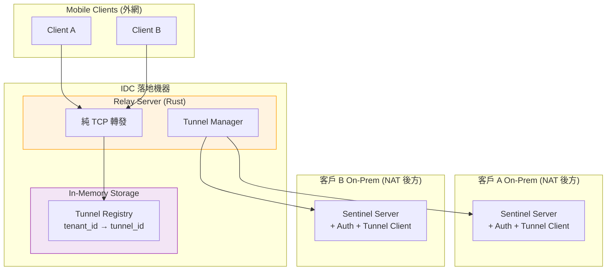
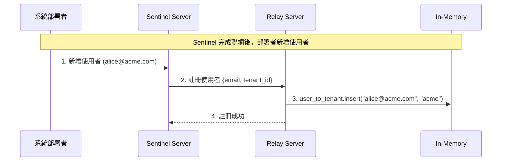
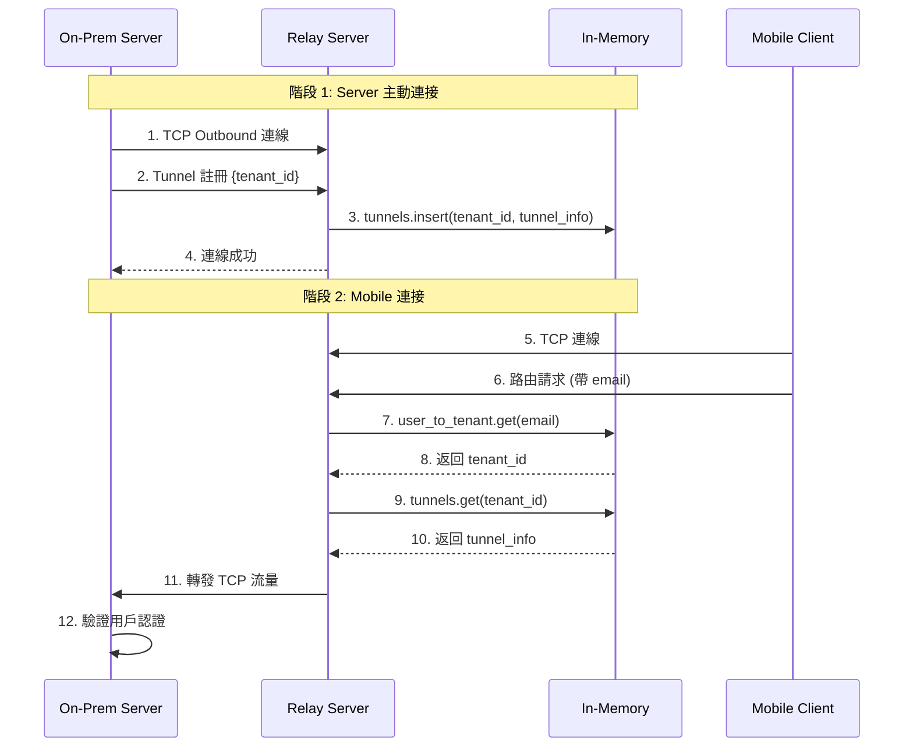

# Relay Server 設計文檔

設計自建 Relay Server，實現 NAT 穿透，讓 Mobile Client 能連接到客戶 On-Premise 的 Sentinel Server。

**架構**：純 TCP 轉發（最簡設計）

**核心設計決策**：
- Relay **不處理認證**，所有 Auth 邏輯由 Sentinel Server 處理
- Relay 是純粹的 TCP 轉發器
- 所有安全檢查（Rate Limiting、IP Blocking 等）**都不在 Relay 層做**

---

## 0. 技術選型：ngrok vs 自建

| 比較項目 | ngrok (SaaS) | 自建 Relay Server |
|---------|--------------|-------------------|
| **部署複雜度** | ⭐ 極簡 | ⭐⭐ 需自行開發 |
| **成本** | 💰 ~$216/月/連線 | 💰 ~$50/月（統一） |
| **多租戶隔離** | ❌ 需用 subdomain 區分 | ✅ 原生支援 |
| **認證處理** | ❌ 需額外整合 | ✅ Sentinel 完全掌控 |
| **資料隱私** | ⚠️ 流量經 ngrok | ✅ 流量經我們自己的 IDC |

**結論**：選擇自建，成本在規模化後更低、Sentinel 完全掌控認證邏輯。

---

## 1. 核心架構

### 1.1 系統架構圖



### 1.2 連線流向

```
Mobile (外網) → Relay (純 TCP 轉發) → On-Prem Sentinel Server (NAT 後方)
                    ↓
              不做任何認證
```

**核心設計**：
1. 所有 Client 連到 `relay.sentinel.com:8443`
2. Relay 根據連線來源決定轉發目標
3. **認證完全由 Sentinel Server 處理**
4. 客戶 Server 主動建立 outbound 連線到 Relay

### 1.3 核心元件

| 元件 | 職責 |
|------|------|
| **TCP 轉發** | 純粹轉發 TCP 流量，不做任何處理 |
| **Tunnel Manager** | 管理 Tunnel 連線、心跳 |
| **In-Memory Storage** | Tunnel 註冊表（HashMap） |

---

## 2. 資料流設計

### 2.1 使用者註冊流程



### 2.2 Tunnel 註冊與連接流程



### 2.2 訊息轉發

```
Client → Relay (不驗證) → Server (On-Prem, 驗證 Auth)
       ←                 ←
```

---

## 3. 多租戶隔離

### 3.1 路由機制

**所有 Client 連到同一個 endpoint**：
```
relay.sentinel.com:8443
```

**Relay 根據請求中的 email 查找 tenant_id，然後路由**：
```rust
// Relay 只轉發，不驗證
let email = extract_email(&packet)?;  // 從封包提取 email
let tenant_id = user_to_tenant.get(&email)?;  // 查找對應的 tenant_id
let tunnel = tunnels.get(&tenant_id)?;  // 查找對應的 Tunnel
forward(tcp_stream, tunnel);
```

### 3.2 隔離保證

- ✅ Tenant A 的流量路由到 Tenant A 的 Tunnel
- ⚠️ **安全由 Sentinel Server 保證**，Relay 不做驗證
- ⚠️ 惡意 Client 可以發送垃圾流量，但 Sentinel 會拒絕無效請求

---

## 4. 通訊協議

### 4.1 連接方式

| 來源 | 連接方式 | 認證 |
|------|---------|------|
| **Mobile Client** | TCP → `relay.sentinel.com:8443` | **由 Sentinel 驗證** |
| **Sentinel Server** | TCP Outbound → `relay.sentinel.com:8443` | Tunnel Token |
| **Sentinel Server** → Relay | 註冊使用者 | 無需認證 |

### 4.2 Sentinel 註冊使用者

當 Sentinel 新增使用者時，會通知 Relay：

```json
// Sentinel → Relay
{
  "type": "register_user",
  "email": "alice@acme.com",
  "tenant_id": "acme"
}
```

### 4.3 Client 路由封包格式

Client 連線後第一個封包必須包含 email：

```json
{
  "type": "route",
  "email": "alice@acme.com"
}
```

Relay 收到後：
1. 提取 email
2. 查 HashMap 找到對應的 tenant_id
3. 查 HashMap 找到對應的 Tunnel
4. 後續所有流量轉發到該 Tunnel
5. **不驗證任何認證資訊**

---

## 5. 連線管理

### 5.1 心跳機制

| 方向 | 間隔 | 超時 |
|------|------|------|
| Relay → Tunnel | 30s | 90s |
| Tunnel → Relay | 30s | 90s |

**注意**：Relay 不對 Client 做心跳檢查，由 Sentinel Server 管理 Client 連線狀態。

### 5.2 重連策略

```
Tunnel 重連: 指數退避 1s → 2s → 4s → 8s (max)
Client 重連: 由 Sentinel Server 控制
```

---

## 6. 技術棧

| 組件 | 技術選擇 |
|------|---------|
| **核心服務** | Rust + tokio |
| **TCP 轉發** | tokio-net |
| **狀態存儲** | In-memory HashMap (std::collections::HashMap) |

**移除的組件**：
- ❌ Nginx（不需要，直接用 Rust 處理 TCP）
- ❌ Redis（用 in-memory HashMap 即可）
- ❌ WebSocket 庫（用純 TCP 即可）
- ❌ 任何認證相關庫

---

## 7. In-Memory 數據結構

```rust
// Relay 註冊表
struct TunnelRegistry {
    // email → tenant_id (Sentinel 註冊使用者時)
    user_to_tenant: HashMap<String, String>,

    // tenant_id → tunnel 連線資訊
    tunnels: HashMap<String, TunnelInfo>,
}

struct TunnelInfo {
    connection: TcpStream,
    status: TunnelStatus,
    last_heartbeat: Instant,
}

enum TunnelStatus {
    Active,
    Idle,
}
```

**特點**：
- ✅ 無需外部依賴
- ✅ 極快查詢速度（O(1)）
- ⚠️ Relay 重啟後所有資料丟失
  - Tunnel 會自動重連
  - Sentinel 需要重新註冊使用者（或在啟動時同步一次）

---

## 8. 相關文檔

- [Container Diagram](./containerDiagram.md)
- [Context Diagram](./contextDiagram.md)
- [System Architecture](./systemArch.md)
- [Connectivity Architecture](./connectivityArch.md)

---

## 9. 純 Rust 架構分析

### 9.1 優點

| 項目 | 說明 |
|------|------|
| **極簡架構** | 單一二進制文件，無需 Nginx |
| **低延遲** | 無額外轉發層 |
| **易部署** | 單一服務，運維簡單 |
| **職責清晰** | Relay 只做轉發，Auth 由 Sentinel 處理 |

### 9.2 缺點 / 風險

| 項目 | 說明 |
|------|------|
| **無保護機制** | 任何人都可連接 Relay（但 Sentinel 會拒絕無效請求） |
| **DDoS 風險** | 惡意流量可直接打到任何 Sentinel |
| **無法追蹤來源** | 真實 Client IP 被 Relay 隱藏 |

### 9.3 結論

**使用純 Rust 架構**：
- 最簡單的實現
- Relay 只做 TCP 轉發
- 所有安全邏輯由 Sentinel Server 處理
- 適合初期快速開發，後續可根據需求加入保護機制
