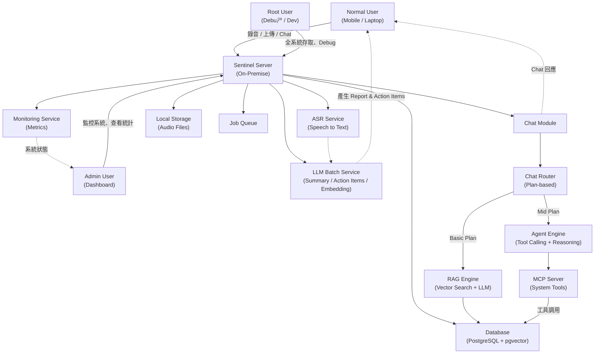

# 元件說明 (Component Description / Legend)

| 元件 | 說明 |
|------|------|
| **Normal User** | 使用 Mobile / Laptop App 建立會議、錄音、查詢報告、修改 Action Items、使用 Chat 查詢過去會議 |
| **Admin User** | 管理者透過 Dashboard 監控系統資源與活躍 Session，但無法查看逐字稿或摘要內容 |
| **Root User** | 系統開發 / Debug 用戶，擁有全部存取權限，用於排錯和開發 |
| **Sentinel Server** | 核心服務，部署在 on-premise PC，負責接收音訊、執行模型分析、存取資料庫及提供 API |
| **ASR Service** | 語音轉文字服務，把錄音 Session 轉成逐字稿 |
| **LLM Batch Service** | 負責批次處理：生成會議摘要 (Report)、自動產生 Action Items、向量化嵌入 |
| **Chat Module** | 處理使用者 Chat 查詢，內含 Router、RAG Engine、Agent Engine，根據使用者 Plan 決定處理模式 |
| **Chat Router** | 根據使用者 Plan 路由：Basic Plan 使用 RAG，Mid Plan 使用 Agent |
| **RAG Engine** | 向量搜尋 + LLM 回答，提供給 Basic Plan 使用者 |
| **Agent Engine** | 工具調用 + 多步推理，提供給 Mid Plan 使用者 |
| **MCP Server** | 將系統能力暴露為 MCP 工具，供 Agent 調用 |
| **Database (PostgreSQL + pgvector)** | 儲存 Session、Transcript、向量化文字及 Action Items，支援語意搜尋 |
| **Local Storage** | 存放暫存的音訊檔案，支援離線錄製及上傳同步 |
| **Job Queue** | 排程批次作業（ASR Job / LLM Job）以非同步處理音訊及生成報告 |
| **Monitoring Service** | 收集系統資源使用狀態 (CPU / Memory / Storage) 及活躍 Session，用於 Admin 查看 |